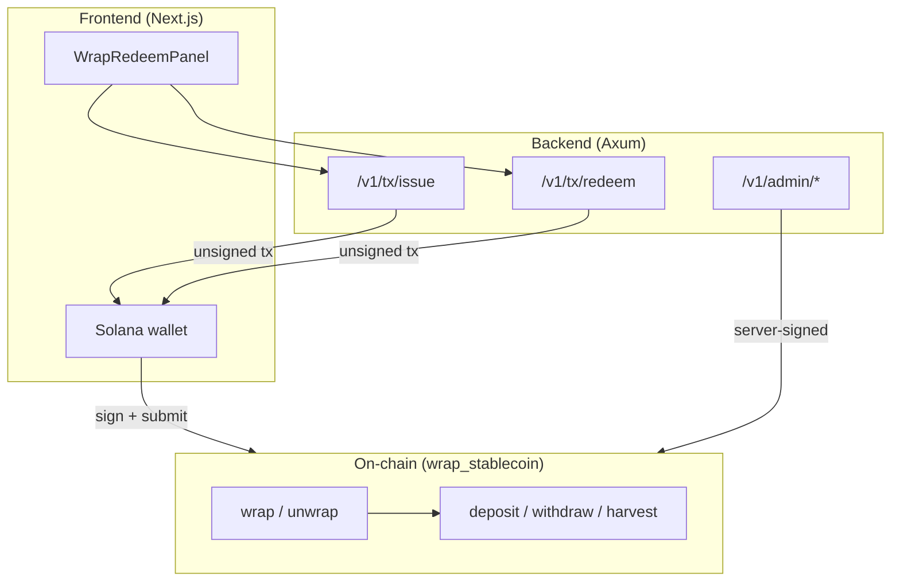
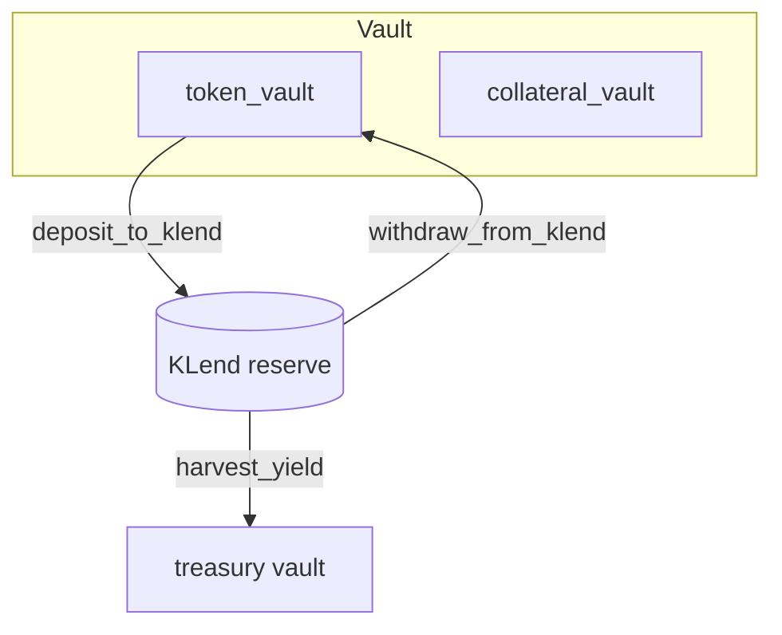

# Architecture

Olympus Complex (Florin (FLRN)) is a **three-layer monorepo**: an Anchor on-chain program, a Rust transaction-builder API, and a Next.js wallet UI.

## High-level layout



| Layer | Location | Role |
|-------|----------|------|
| **On-chain** | `wrap-stablecoin/programs/wrap-stablecoin/` | Mint/burn Florin (FLRN), hold collateral, CPI into Kamino KLend |
| **Backend** | `backend/` | Build unsigned wrap/unwrap txs; execute admin vault and KLend ops |
| **Frontend** | `frontend/` | Wallet connect, call API, sign and send txs |

Program ID: `5JmAnBvF8akh9N36bqoxZdAsyv4SeW6oNedJpj3WUSoT`

---

## Purpose

Olympus Complex issues a **yield-bearing wrapped stablecoin (Florin (FLRN))** backed 1:1 by registered collateral (USDC at launch). Users deposit collateral and receive Florin (FLRN); underlying assets can be supplied to **Kamino KLend** to earn yield. Yield accrues to per-asset treasury vaults controlled by the protocol, not to Florin (FLRN) supply.

**Core value proposition:** Deposit stables → receive Florin (FLRN) → protocol captures KLend yield to treasury; redemptions draw from backing vaults at 1:1.

Flash mint (same-transaction Florin (FLRN) borrow) is **not compiled into the shipped program**. See [Flash-mint.md](./Flash-mint.md) for the experimental, feature-gated design preserved for optional future market-making.

---

## Design philosophy

### 1. Composability over isolation

The on-chain program is intentionally thin. KLend handles lending. Users wrap and unwrap **registered collateral** directly (USDC, USDT, and other USD stables the admin has `add_asset`'d). Each pool has its own vault and liability.

### 2. Multi-asset collateral, single Florin (FLRN) mint

Each registered asset has its own `AssetConfig`, vaults, and optional KLend wiring. Florin (FLRN) supply tracks aggregate user liability across assets. Users pick a collateral pool in the UI and wrap/unwrap that mint 1:1 (subject to haircuts and caps).

### 3. Authority-centric configuration with rotatable admin

Each vault is keyed by an immutable **authority** (the PDA-seed creator). A separate, rotatable **admin** controls operational policy: pause, treasury, allowlist, asset policy. Admin transfer is a two-step propose/accept flow.

### 4. Security through constraints

- **CPI-as-oracle harvest** — `harvest_yield` derives the kToken→collateral rate from the redeem CPI itself.
- **Pinned KLend accounts** — reserve and market accounts bound at `enable_klend`.
- **Allowlist PDA validation** — `check_access` re-derives the allowlist address from `(vault_config, bump)`.
- **Pause** — emergency stop covers wrap, unwrap, Kamino deposit, and harvest. Recall, sweep, and treasury withdrawal remain available.

### 5. Yield to treasury, not to wrapped supply

Florin (FLRN) supply tracks deposited collateral 1:1 (per asset policy). Lending yield accumulates in KLend kTokens; the admin redeems surplus into the asset treasury via `harvest_yield`. Florin (FLRN) redemption value does not float above 1:1 from yield accrual.

---

## Account topology

Related types: `VaultConfig`, `AssetConfig`, `KLendConfig`, `Allowlist`.

`VaultConfig` carries immutable `authority`, rotatable `admin`/`pending_admin`, wrapped mint, registered assets, `total_stable_deposited`, and policy flags. Four `flash_*` fields are **reserved layout** for an optional experimental feature (unused in shipped build).

`AssetConfig` (seed `token_config`) pins per-asset mint, vaults, treasury, decimals, caps, and KLend enablement.

### PDA seeds

| PDA | Seeds | Role |
|-----|-------|------|
| `vault_config` | `["vault_config", authority]` | Vault state, admin policy |
| `vault_authority` | `["vault_authority", vault_config]` | Signer for token + KLend CPIs |
| `wrapped_mint` | `["wrapped_mint", vault_config]` | Florin (FLRN) mint |
| `asset_config` | `["token_config", vault_config, token_mint]` | Per-asset registry |
| `token_collateral_vault` | `["token_collateral_vault", asset_config]` | KLend kToken vault |
| `token_vault` | `["token_vault", asset_config]` | Free collateral vault |
| `treasury_vault` | `["treasury_vault", asset_config]` | Yield recipient |
| `klend_config` | `["klend_config", asset_config]` | Pinned KLend accounts |
| `allowlist` | `["allowlist", vault_config]` | Optional gate for non-public IO |

---

## High-level flows

### Wrap

```mermaid
flowchart LR
    User -->|collateral transfer_checked| TokenVault[token_vault]
    Program -->|mint 1:1 of received| UserWStable[user Florin (FLRN) ATA]
    Program -. updates .-> Totals[total_stable_deposited / asset totals]
```

Wrap snapshots vault balance before and after transfer, then mints Florin (FLRN) on the **delta received**. Florin is classic SPL Token; collateral may be SPL or Token-2022 with an empty extension set.

### Unwrap

```mermaid
flowchart LR
    User -->|Florin (FLRN)| Burn((burn))
    TokenVault[token_vault] -->|collateral 1:1| User
    Program -. updates .-> Totals
```

Unwrap requires `token_vault` to hold enough free collateral. If too much sits in KLend, admin calls `withdraw_from_klend` first.

### Admin liquidity flow



`harvest_yield` enforces a conservative backing invariant from the redeem CPI rate. KLend rounds liquidity down, making the check strictly conservative.

---

## Instruction surface (shipped build)

**Lifecycle:** `initialize`, `add_asset`, `enable_klend`, `update_asset_policy`

**User-facing:** `wrap`, `unwrap`

**Admin liquidity:** `deposit_to_klend`, `deposit_all_to_klend`, `withdraw_from_klend`, `withdraw_all_from_klend`, `harvest_yield`, `sweep_home_surplus`, `withdraw_treasury`

**Admin policy:** pause, public wrap/unwrap toggles, allowlist, two-step admin transfer

---

## External dependencies

| Dependency | Role |
|------------|------|
| **KLend** | Lending via CPI |
| **SPL Token / Token-22** | Florin mint/burn is classic SPL; collateral transfer may be SPL or Token-2022 with no extensions |

---

## Security model

| Threat | Mitigation |
|--------|------------|
| Foreign-allowlist bypass | PDA re-derivation in `check_access` |
| Fee-on-transfer over-mint | Mint on vault delta, not claimed amount |
| Admin under-backing via harvest | Residual-backing invariant from CPI rate |
| Reserve substitution post-init | Pinned KLend accounts at `enable_klend` |
| Unauthorized admin actions | `has_one = admin` on admin instructions |
| Reflexive collateral | Florin (FLRN) cannot back itself |

---

## Deploy note (Folkmoot / production)

List and deploy **only the default program build**:

```bash
cd wrap-stablecoin && anchor build
```

Do not ship `--features flash-mint` to production or Folkmoot. See [Flash-mint.md](./Flash-mint.md) for re-enable steps.

---

## Summary

Olympus Complex is a **multi-asset collateral wrapper** that:

1. Mints Florin (FLRN) 1:1 against registered assets and routes principal to KLend when enabled.
2. Sends lending yield to per-asset treasury vaults; Florin (FLRN) supply stays at par.
3. Separates immutable `authority` from rotatable `admin`.
4. Accepts multiple registered USD collaterals via per-pool `wrap` / `unwrap`.
5. Ships without flash mint; experimental flash code remains behind the `flash-mint` Cargo feature.
