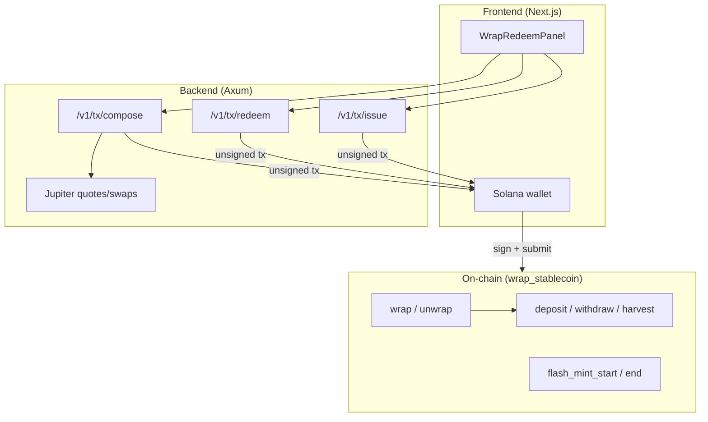
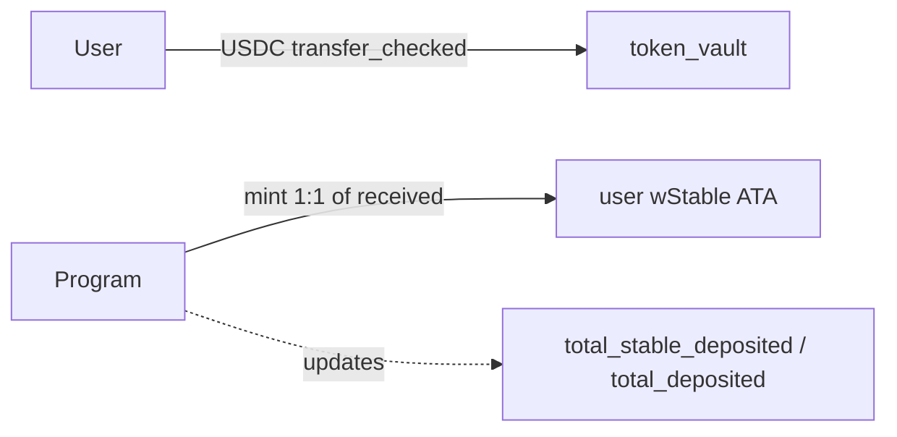
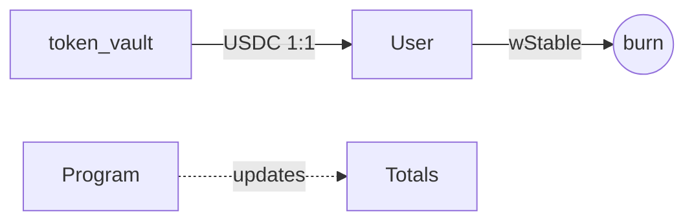
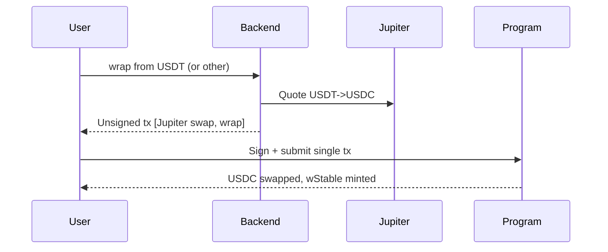
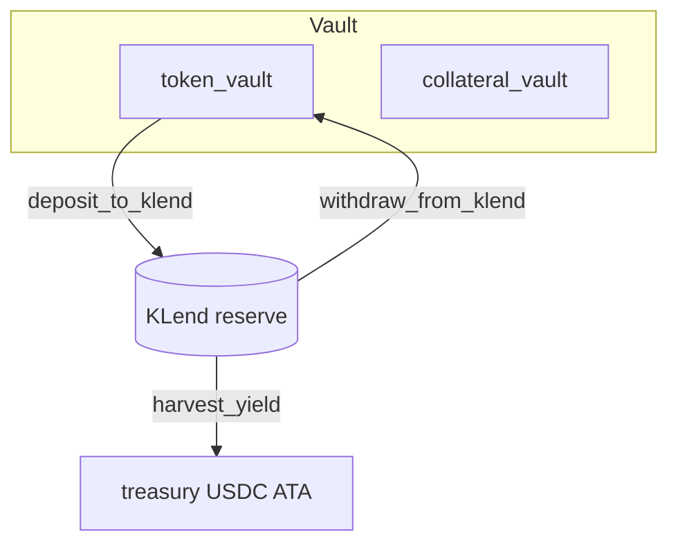
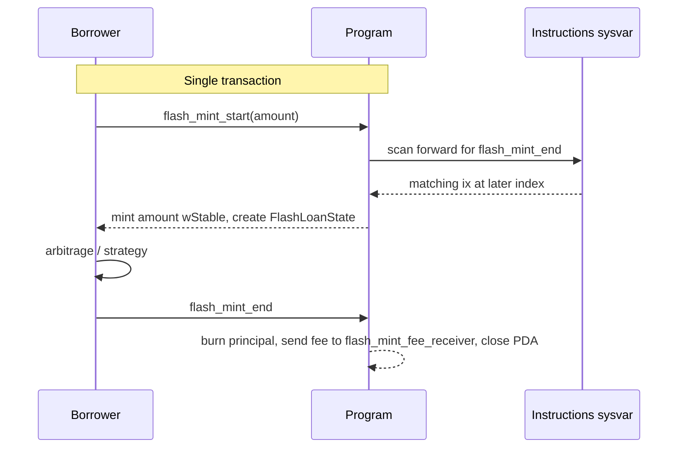

# Architecture

Olympus Complex (wStable) is a **three-layer monorepo**: an Anchor on-chain program, a Rust transaction-builder API, and a Next.js wallet UI.

## High-level layout



| Layer | Location | Role |
|-------|----------|------|
| **On-chain** | `wrap-stablecoin/programs/wrap-stablecoin/` | Mint/burn wStable, hold USDC, CPI into Kamino KLend |
| **Backend** | `backend/` | Build unsigned Solana txs; optionally bundle Jupiter swaps |
| **Frontend** | `frontend/` | Wallet connect, call API, sign and send txs |

Program ID: `5JmAnBvF8akh9N36bqoxZdAsyv4SeW6oNedJpj3WUSoT`

---

## Purpose

Olympus Complex issues a **yield-bearing wrapped stablecoin (wStable)** backed 1:1 by USDC. Users deposit USDC and receive wStable; underlying USDC can be supplied to **Kamino KLend** to earn yield. Yield accrues to a treasury account controlled by the protocol, not to wStable supply. The protocol also offers a permissioned **flash mint** of wStable for same-transaction borrowing.

**Core value proposition:** A simple, single-mint wrapped stablecoin that earns lending yield for the treasury and exposes a flash-mint primitive on its own supply.

---

## Design philosophy

### 1. Composability over isolation

The on-chain program is intentionally thin. KLend handles lending; the backend routes non-USDC inputs through Jupiter and bundles them with `wrap` / `unwrap` into a single user-signed transaction. The on-chain program never CPIs into Jupiter.

### 2. Single base token, multi-input via off-chain swap

The on-chain `wrap` instruction accepts only USDC. Multi-stablecoin support is a **backend/UX concern**: the backend builds a Jupiter swap → wrap (or unwrap → Jupiter swap) bundle so users can interact while holding USDT, etc. On-chain accounting stays unambiguous.

### 3. Authority-centric configuration with rotatable admin

Each vault is keyed by an immutable **authority** (the PDA-seed creator). A separate, rotatable **admin** controls operational policy: pause, treasury, allowlist, flash-mint settings. Admin transfer is a two-step propose/accept flow.

### 4. Security through constraints

- **Transaction introspection** — `flash_mint_start` walks the instructions sysvar to confirm a matching `flash_mint_end` exists later in the same transaction before it mints.
- **One-shot flash-loan PDA** — unique PDA per (borrower, vault); closed on end.
- **CPI-as-oracle harvest** — `harvest_yield` derives the kToken→USDC rate from the redeem CPI itself.
- **Pinned KLend accounts** — reserve and market accounts bound at `initialize`.
- **Allowlist PDA validation** — `check_access` re-derives the allowlist address from `(vault_config, bump)`.
- **Pause** — emergency stop covers wrap, unwrap, KLend ops, harvest, and flash-mint start.

### 5. Yield to treasury, not to wrapped supply

wStable supply tracks deposited USDC 1:1. Lending yield accumulates in KLend kTokens; the admin redeems surplus into the treasury via `harvest_yield`. wStable redemption value never floats above 1:1.

---

## Account topology

Related types: `VaultConfig`, `TokenConfig`, `Allowlist`, `FlashLoanState`.

`VaultConfig` carries immutable `authority`, rotatable `admin`/`pending_admin`, wrapped and base mints, pinned KLend market, **two payout accounts** (`treasury` for harvested USDC, `flash_mint_fee_receiver` for flash-mint wStable fees), `total_stable_deposited`, and policy flags.

`TokenConfig` is a single instance for the base token. It pins the KLend reserve, collateral mint, liquidity supply, `token_vault` (free USDC), `collateral_vault` (kTokens), decimals, and `total_liquidity_in_klend`.

### PDA seeds

| PDA | Seeds | Role |
|-----|-------|------|
| `vault_config` | `["vault_config", authority]` | Vault state, admin policy |
| `vault_authority` | `["vault_authority", vault_config]` | Signer for token + KLend CPIs |
| `wrapped_mint` | `["wrapped_mint", vault_config]` | wStable mint |
| `token_config` | `["token_config", vault_config, token_mint]` | Per-token registry (base only) |
| `token_collateral_vault` | `["token_collateral_vault", token_config]` | KLend kToken vault |
| `token_vault` | `["token_vault", token_config]` | Free USDC vault |
| `allowlist` | `["allowlist", vault_config]` | Optional gate for non-public IO |
| `flash_loan` | `["flash_loan", borrower, vault_config]` | Ephemeral flash-mint state |

---

## High-level flows

### Wrap (base token only)



Wrap snapshots `token_vault` balance before and after transfer, then mints wStable on the **delta received**. Wrap rejects non-base tokens via `is_base_token`.

### Unwrap



Unwrap requires `token_vault` to hold enough free USDC. If too much sits in KLend, admin calls `withdraw_from_klend` first.

### Off-chain multi-token wrap (backend `/v1/tx/compose`)



### Admin liquidity flow



`harvest_yield` enforces:

```
collateral_after × (liquidity_received / ktokens_redeemed) ≥ total_liquidity_in_klend
```

KLend rounds `liquidity_received` down, making the check strictly conservative.

### Flash mint



### Why two payout accounts

- **`treasury`** — USDC ATA for `harvest_yield` (KLend writes liquidity directly).
- **`flash_mint_fee_receiver`** — wStable ATA for flash-mint fees.

These cannot be the same account: harvest needs a USDC token account; fees need a wStable destination with distinct constraint semantics.

---

## Instruction surface

**User-facing:** `wrap`, `unwrap`

**Admin liquidity:** `deposit_to_klend`, `withdraw_from_klend`, `harvest_yield`

**Admin policy:** pause, public wrap/unwrap toggles, allowlist, treasury, two-step admin transfer, flash-mint config

**Flash mint:** `flash_mint_start`, `flash_mint_end`

`initialize` bootstraps the entire vault in one call — no `add_token` / `remove_token`.

---

## External dependencies

| Dependency | Role |
|------------|------|
| **KLend** | Lending via CPI |
| **SPL Token / Token-22** | Mint, transfer_checked, burn |
| **Sysvar: Instructions** | Flash-mint introspection |
| **Jupiter** *(backend)* | Off-chain swaps via `/v1/tx/compose` |

---

## Security model

| Threat | Mitigation |
|--------|------------|
| Missing `flash_mint_end` | Instructions-sysvar forward scan |
| Wrong borrower / vault on flash end | Introspection binds accounts |
| Flash-loan replay | Init + close PDA per (borrower, vault) |
| Foreign-allowlist bypass | PDA re-derivation in `check_access` |
| Fee-on-transfer over-mint | Mint on vault delta, not claimed amount |
| Admin under-backing via harvest | Residual-backing invariant from CPI rate |
| Reserve substitution post-init | Pinned KLend accounts at init |
| Unauthorized admin actions | `has_one = admin` on admin instructions |

---

## Summary

Olympus Complex is a **single-base-USDC wrapper** that:

1. Mints wStable 1:1 against USDC and routes principal to KLend.
2. Sends lending yield to treasury; wStable supply stays at par.
3. Exposes permissioned flash-mint with same-tx repayment.
4. Separates immutable `authority` from rotatable `admin`.
5. Defers swap aggregation to the backend Jupiter bundler.
