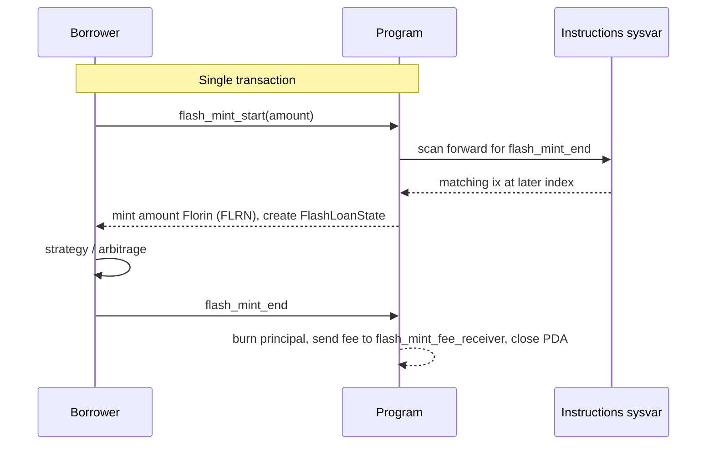

# Flash mint (experimental, disabled in shipped build)

Flash mint is a **same-transaction borrow** of Florin (FLRN): mint principal to a borrower, require matching repayment (principal + fee) before the transaction completes. The implementation remains in the repository for optional future market-making, but **Folkmoot and production deploy only the default build** — flash instructions are not compiled into the shipped program binary and do not appear in the IDL.

## Shipped vs experimental

| | Default build (`anchor build`) | Experimental (`--features flash-mint`) |
|---|---|---|
| Binary | No flash handlers | Flash handlers compiled |
| IDL | No flash instructions or `FlashLoanState` | Flash surface present when IDL is built with the feature |
| Backend / frontend | No API or UI | PDA helper only (`flash_loan_state`) |
| Folkmoot listing | **This build only** | Not listed |

`VaultConfig` still carries four **reserved** flash fields (`flash_mint_enabled`, `flash_mint_fee_bps`, `flash_mint_max_amount`, `flash_mint_fee_receiver`). They are initialized to safe defaults at `initialize` and are inert in the shipped program.

## Design (when enabled)



### Security properties

- **Transaction introspection** — `flash_mint_start` walks the instructions sysvar to confirm a matching `flash_mint_end` exists later in the same transaction before minting.
- **One-shot PDA** — `["flash_loan", borrower, vault_config]` is created on start and closed on end; prevents replay and double-mint in one tx.
- **Admin override when disabled** — if `flash_mint_enabled` is false, only the vault admin may start a flash mint.
- **Separate fee receiver** — Florin (FLRN) fees go to `flash_mint_fee_receiver` (distinct from per-asset USDC treasury used by `harvest_yield`).

### Admin levers (feature-gated)

- `set_flash_mint_enabled`
- `set_flash_mint_fee(fee_bps)` — max 10000 (100%)
- `set_flash_mint_max_amount` — `0` = no cap
- `set_flash_mint_fee_receiver`

## Source layout

| Path | Role |
|---|---|
| `programs/wrap-stablecoin/src/instructions/flash_mint.rs` | Account structs + introspection helper |
| `programs/wrap-stablecoin/src/instructions/flash_ix_handlers.rs` | Handler bodies (included in `#[program]` when feature on) |
| `programs/wrap-stablecoin/src/state/flash_loan_state.rs` | Transient loan PDA state |
| `programs/wrap-stablecoin/tests/integration_test.rs` | `test_flash_mint` (feature-gated) |

Cargo feature: `flash-mint` in `programs/wrap-stablecoin/Cargo.toml` (non-default).

## Re-enable checklist

1. Product decision + security review of the `--features flash-mint` binary.
2. Build and audit:
   ```bash
   cd wrap-stablecoin
   anchor build -- --features flash-mint
   ```
3. Run integration test (requires local validator + `ANCHOR_WALLET`):
   ```bash
   cargo test -p wrap-stablecoin --features flash-mint test_flash_mint
   ```
4. Wire backend HTTP routes / tx builders only if exposing to integrators.
5. **New program deploy / listing** — not an in-place toggle on a Folkmoot-listed no-flash binary.
6. Update this doc and active architecture pages from experimental → active.

## Explicitly not in scope for shipped product

- Runtime-only disable (flash ix still in IDL/binary)
- Backend or frontend flash UX without the above checklist
- Using flash mint for the core wrap / unwrap / KLend yield loop
