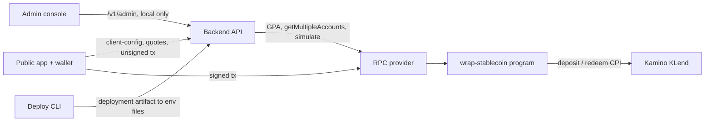
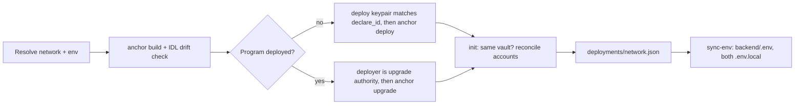
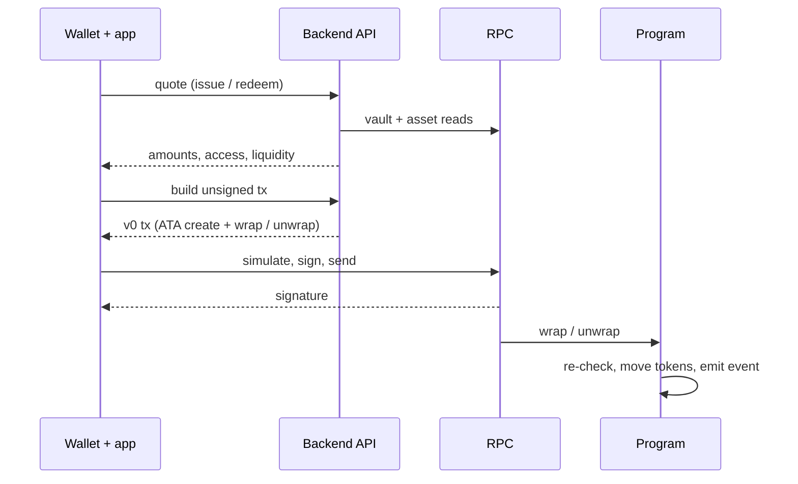
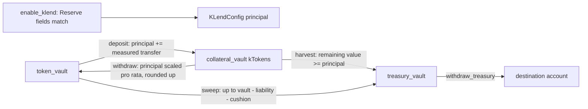

# Flows

Interactive diagrams of how Florin (FLRN) moves through the system, from shipping the program to a cluster through user wrap/unwrap to Kamino yield. Each section summarises one diagram; the diagram carries the detail (pan/zoom, search, focus and trace are built into the page).

| Diagram | Type | Covers |
|---|---|---|
| [System architecture](diagrams/system-architecture.html) | Architecture | Apps, backend, RPC, program, Kamino, deploy CLI |
| [Deployment CLI](diagrams/deploy-cli.html) | Workflow | `deploy` -> `init` -> `sync-env` per network, with its abort gates |
| [Wrap / unwrap](diagrams/wrap-unwrap.html) | Sequence | Quote, unsigned tx build, wallet signing, on-chain checks |
| [Kamino yield](diagrams/kamino-yield.html) | Data flow | Deploy, recall, harvest, sweep and the principal invariants |

The HTML files are self-contained: open them in a browser from a checkout (GitHub shows their source rather than rendering them).

## System architecture

### Overview

One backend process serves one Solana cluster. It builds unsigned transactions and quotes for the public app, exposes an unauthenticated admin API meant to stay on loopback, and reads chain state through a single RPC provider. The on-chain program holds collateral in per-asset vaults and moves idle liquidity into Kamino KLend on admin instruction.

### Flow

### Components

- **Public app and admin console** bootstrap from `GET /v1/client-config`; the only env they carry is the backend URL.
- **Backend API** mounts the public `/v1/vault`, `/v1/quote` and `/v1/tx` routers and the `/v1/admin` router, all behind a network guard that rejects a request naming a different cluster. RPC work runs on the blocking pool; public errors hide inner causes, admin errors return the full chain.
- **RPC provider** must serve `getProgramAccounts` with memcmp filters (asset discovery has no fallback) and batched `getMultipleAccounts`.
- **Program** keeps vault state in PDAs (vault config, per-asset config and vaults, KLend config, allowlist) and calls KLend by CPI. The backend prepends a KLend `refresh_reserve` with the reserve's Scope or Pyth price account.
- **Deploy CLI** records each cluster in a deployment artifact and renders the backend and frontend env files from it.

Related types: AppState, VaultConfig, AssetConfig, KLendConfig, Deployment

## Deployment CLI

### Overview

`pnpm cli` ships the program and bootstraps a vault on any cluster. Every step checks what is already on chain or on disk and aborts instead of guessing, so a wrong signer, a stale IDL or a mismatched artifact stops the run before it spends SOL.

### Flow

### Components

- **Network resolution** reads network-scoped keys only; unscoped keys and fixture keypairs are a localnet convenience, and mainnet writes need an explicit confirmation. See the CLI environment table in the [program README](../wrap-stablecoin/README.md).
- **Deploy** always rebuilds, requires the tracked IDL to match the build, then either publishes under the deploy keypair (which must equal `declare_id!`) or upgrades as the on-chain upgrade authority. Once that authority is a multisig, upgrades go through a buffer outside the CLI.
- **Init** refuses an artifact recorded for another program or admin, then runs initialize, add asset and enable KLend, skipping accounts that already exist and failing when they disagree with the requested decimals mint or reserve. Reserve fields are read from the on-chain Reserve.
- **Sync-env** refuses an artifact that is missing a required field or records another cluster, and rewrites the managed backend keys and both frontend env files.
- **Localnet** runs the same `init` and `sync-env` from `anchor run local` after the validator starts and dummy mints are seeded.

Related types: Network, NetworkContext, CliContext, Deployment, DeployedAsset

## Wrap / unwrap

### Overview

The user never hands the backend a signature. The backend quotes and builds an unsigned transaction; the wallet signs it in the browser and the app submits it to the RPC. The program re-checks everything the backend checked, so the backend's checks are UX, not security.

### Flow

### Components

- **Quotes** are public reads: a failed token vault balance read degrades to zero with a warning, while a failed vault or asset config read still fails the quote.
- **Transaction build** is a write path: it checks pause, allowlist, registered asset and policy, and for unwrap the pool liability and free liquidity. A failed read fails the request, and the client sees only the outer error context.
- **Wrap on chain** transfers collateral into the asset's token vault, mints against the measured vault increase minus the mint haircut, and enforces the mint and exposure caps when they are set.
- **Unwrap on chain** burns the wrapped tokens, applies the redemption haircut within the pool liability, and pays collateral out of the token vault signed by the vault authority.
- **Submission** simulates first and retries once on an expired blockhash; the app currently reports success on send, not on confirmation.

Related types: IssueQuoteView, RedeemQuoteView, VaultConfig, AssetConfig

## Kamino yield

### Overview

Idle collateral earns yield in a Kamino KLend reserve. All moves are admin instructions. The program tracks the principal it put into Kamino and uses it as a floor: yield is whatever Kamino holds above that principal, and nothing may move user backing into the treasury.

### Flow

### Components

- **Enable** reads market, liquidity mint, supply vault and kToken mint from the on-chain Reserve and rejects any mismatch with the passed accounts or the asset's registered mint.
- **Deposit** keeps the home vault at or above its minimum liquidity target and grows principal by the amount that actually left the vault.
- **Withdraw** checks the kToken balance before redeeming, then scales principal to the surviving kToken share, rounding up so the floor is never understated. Full and partial recall share one path.
- **Harvest** redeems into the treasury and requires the value left in Kamino, priced at that redeem's rate, to still cover principal. Principal itself does not change.
- **Sweep** moves home vault surplus above the pool liability and the minimum liquidity target into the treasury. Kamino yield reaches the treasury either directly through harvest, or through a recall followed by a sweep.
- **Treasury withdrawal** only sees the treasury, which is not part of user backing.
- **Pause** blocks deposit and harvest (and user wrap and unwrap); recall, sweep and treasury withdrawal are not gated by pause.
- **Backend caps** for recall and harvest come from a simulated reserve refresh, falling back to the stored reserve.

Related types: KLendConfig, AssetConfig, KlendReserveMark

## Maintaining the diagrams

The HTML files are generated by archify from the specs in `wiki/diagrams/src/`. Edit the spec, re-run archify's `deliver` for that diagram type, and commit both; never edit the HTML by hand.

The architecture spec links each component to source lines at a pinned commit. Archify verifies those links against a local checkout, so validating or delivering it needs the repository root passed to archify, and the pinned commit must exist locally. When the linked code changes, update the pinned commit and the line references together.
