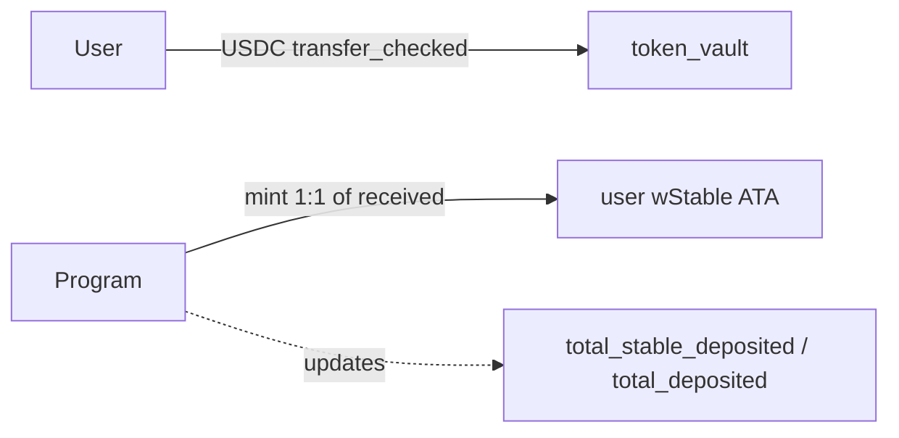
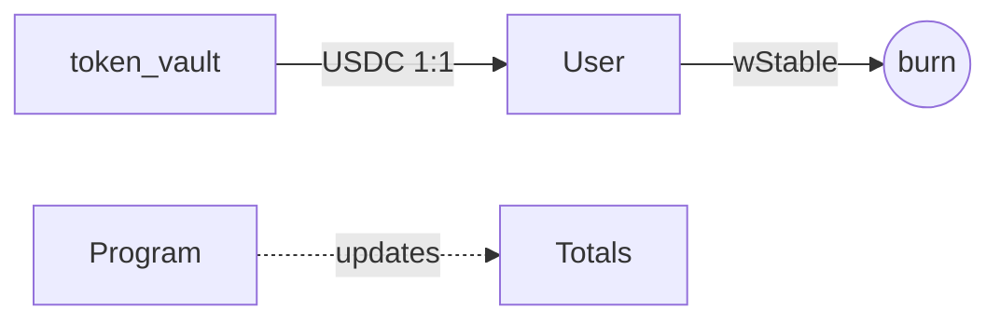
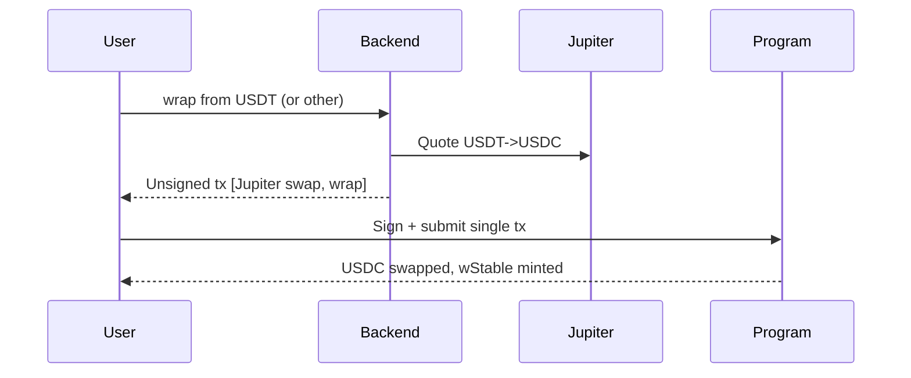
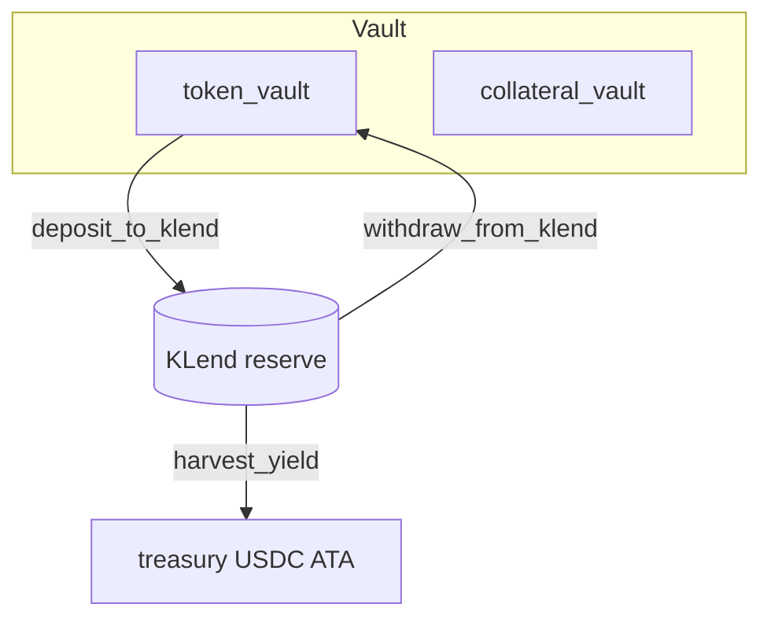
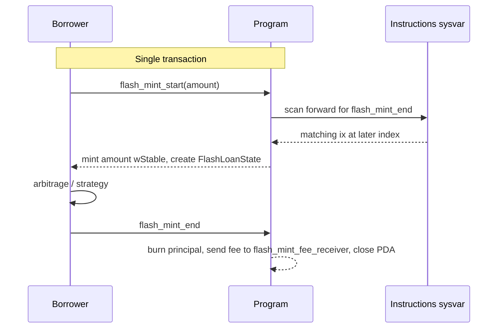

# Olympus Complex — Architecture & Design Philosophy

## Purpose

Olympus Complex is a Solana protocol that issues a **yield-bearing wrapped stablecoin (wStable)** backed 1:1 by a base stablecoin (USDC). Users deposit USDC and receive wStable; the underlying USDC is supplied to **Kamino KLend** to earn yield. Yield accrues to a treasury account controlled by the protocol, not to wStable supply. The protocol also offers a permissioned **flash mint** of wStable for same-transaction borrowing.

**Core value proposition:** A simple, single-mint wrapped stablecoin that earns lending yield for the treasury and exposes a flash-mint primitive on its own supply.

---

## Design Philosophy

### 1. Composability over isolation

The on-chain program is intentionally thin. KLend handles lending; the backend (off-chain) routes non-USDC inputs through Jupiter and bundles them with `wrap` / `unwrap` into a single user-signed transaction. The on-chain program never CPIs into Jupiter.

### 2. Single base token, multi-input via off-chain swap

The on-chain `wrap` instruction accepts only the base token (USDC). Multi-stablecoin support is a **backend/UX concern**: the backend builds a Jupiter swap → wrap (or unwrap → Jupiter swap) bundle so users can interact with the protocol while holding USDT, etc. This keeps the on-chain accounting unambiguous.

### 3. Authority-centric configuration with rotatable admin

Each vault is keyed by an immutable **authority** (the PDA-seed creator). A separate, rotatable **admin** field controls operational policy: pause, treasury, allowlist, flash-mint settings. Admin transfer is a two-step propose/accept flow.

### 4. Security through constraints

- **Transaction introspection** — `flash_mint_start` walks the instructions sysvar to confirm a matching `flash_mint_end` exists later in the same transaction before it mints.
- **One-shot flash-loan PDA** — `flash_mint_start` creates a unique PDA per (borrower, vault) and `flash_mint_end` closes it; same tx can't double-mint, future tx can't reuse.
- **CPI-as-oracle harvest** — `harvest_yield` derives the kToken→USDC rate from the redeem CPI itself; the admin never attests a rate, and KLend's downward rounding makes the residual-backing check strictly conservative.
- **Pinned KLend accounts** — `lending_market`, `reserve`, `reserve_liquidity_supply`, `collateral_mint`, and `lending_market_authority` are all bound at `initialize` and pinned by `address` constraints on every later CPI; admin cannot substitute reserves post-init.
- **Allowlist PDA validation** — `check_access` re-derives the allowlist address from `(vault_config, bump)`, blocking attempts to bypass the gate by passing an allowlist seeded under a different vault.
- **Pause** — Emergency stop covers wrap, unwrap, deposit/withdraw KLend, harvest, and flash-mint start.

### 5. Yield to treasury, not to wrapped supply

wStable supply tracks deposited USDC 1:1. Lending yield accumulates in KLend kTokens; the admin redeems the surplus into the treasury via `harvest_yield`. wStable's redemption value never floats above 1:1 — yield is a separate cashflow.

---

## Account Topology

Related types: `VaultConfig`, `TokenConfig`, `Allowlist`, `FlashLoanState`.

`VaultConfig` carries the vault's identity (immutable `authority`, rotatable `admin`/`pending_admin`), the wrapped mint and base mint, the pinned KLend market, the **two distinct payout accounts** (`treasury` for harvested USDC, `flash_mint_fee_receiver` for flash-mint wStable fees), the live wStable supply (`total_stable_deposited`), and policy flags (`paused`, `wrap_public`, `unwrap_public`, `flash_mint_enabled`, `flash_mint_fee_bps`, `flash_mint_max_amount`).

`TokenConfig` is a single instance for the base token. It pins the KLend reserve, the collateral mint, the reserve's liquidity supply, the two vault-authority-owned accounts (`token_vault` for free USDC, `collateral_vault` for KLend kTokens), the token decimals captured at init, and `total_liquidity_in_klend` — the principal sent to KLend net of liquidity recovered.

### PDA seeds

| PDA                      | Seeds                                        | Role                            |
| ------------------------ | -------------------------------------------- | ------------------------------- |
| `vault_config`           | `["vault_config", authority]`                | Vault state, admin policy       |
| `vault_authority`        | `["vault_authority", vault_config]`          | Signer for token + KLend CPIs   |
| `wrapped_mint`           | `["wrapped_mint", vault_config]`             | wStable mint                    |
| `token_config`           | `["token_config", vault_config, token_mint]` | Per-token registry (base only)  |
| `token_collateral_vault` | `["token_collateral_vault", token_config]`   | KLend kToken vault              |
| `token_vault`            | `["token_vault", token_config]`              | Free USDC vault                 |
| `allowlist`              | `["allowlist", vault_config]`                | Optional gate for non-public IO |
| `flash_loan`             | `["flash_loan", borrower, vault_config]`     | Ephemeral flash-mint state      |

---

## High-Level Flows

### Wrap (base token only)



Wrap snapshots `token_vault`'s balance before and after the user's transfer, then mints wStable based on the **delta received** — fee-on-transfer mints can never over-mint. Wrap rejects non-base tokens via `is_base_token`.

### Unwrap



Unwrap requires `token_vault` to hold enough free USDC to satisfy the redemption. If too much USDC sits in KLend, the admin must first call `withdraw_from_klend` to refill the vault.

### Off-chain multi-token wrap (backend `/v1/tx/compose`)



Jupiter integration is owned entirely by the backend. The on-chain program sees only USDC at the `wrap` entry point.

### Admin liquidity flow



`deposit_to_klend` increments `total_liquidity_in_klend` by the principal sent. `withdraw_from_klend` decrements it (saturating) by the **liquidity actually returned**, so rate appreciation is absorbed correctly without producing negative principal. `harvest_yield` does not touch `total_liquidity_in_klend`; instead it enforces the residual-backing invariant directly from the CPI's measured exchange rate:

```
collateral_after × (liquidity_received / ktokens_redeemed) ≥ total_liquidity_in_klend
```

KLend rounds `liquidity_received` down, which makes the implied rate an upper bound on truth and the inequality strictly conservative — admin cannot harvest into user backing.

### Flash mint



`flash_mint_start` accepts the call only if `flash_mint_enabled` is true or the caller is the admin. Introspection binds the matched `flash_mint_end` to (borrower, vault_config, flash_loan_state, wrapped_mint); any mismatch fails the tx atomically, which also reverts the start's mint. `flash_mint_end` is callable by anyone holding the FlashLoanState PDA, but constraints pin both `borrower_wrapped` (owner = borrower, mint = wStable) and `fee_receiver` (key = `flash_mint_fee_receiver`, mint = wStable).

If `flash_mint_fee_bps > 0` and `flash_mint_fee_receiver` is unset, `flash_mint_start` fails fast (`FlashMintFeeReceiverUnset`) instead of letting the whole tx revert at end-time.

### Why two payout accounts

`treasury` is the destination of `harvest_yield`'s KLend redeem CPI, so it must be a **USDC token account** (KLend writes liquidity into it directly, with the vault_authority as the signer that owns it). `flash_mint_fee_receiver` is the destination of `flash_mint_end`'s fee transfer, so it must be a **wStable token account**. The two roles can never be served by the same account: a single Pubkey cannot be simultaneously an SPL token account address (for harvest) and a wallet authority of another token account (for the fee transfer constraint). The fields are managed independently, with separate admin setters.

---

## Key Components

### Vault initialization

`initialize` is single-shot and bootstraps the entire vault: vault_config, wrapped_mint, vault_authority, the base token_config, the token_vault, and the collateral_vault — all in one call. There is no separate `add_token` / `remove_token`.

### Wrap / Unwrap

Both gated by `paused`, by `check_access` (admin-bypass + optional allowlist when `wrap_public` / `unwrap_public` is false), and by `is_base_token` on the token_config. Decimals are pinned to USDC at init, so wrap and unwrap are unambiguously 1:1.

### Admin liquidity management

`deposit_to_klend`, `withdraw_from_klend`, and `harvest_yield` are admin-only. All KLend CPI accounts are bound to values captured at `initialize` so admin cannot redirect reserve interactions post-init.

### Flash mint

Four admin levers — `flash_mint_enabled`, `flash_mint_fee_bps` (capped at 100%), `flash_mint_max_amount`, and `flash_mint_fee_receiver`. Disabled by default. When disabled, only the admin can start a flash mint; when enabled, any account can.

### Allowlist

A single allowlist per vault, capped at 64 entries, seeded under `vault_config`. `check_access` re-derives the expected PDA from the passed account's `bump` and the vault_config key, blocking allowlists from foreign vaults.

### Two-step admin transfer

`transfer_authority` records `pending_admin`; `accept_authority` requires the pending key to sign and rejects `Pubkey::default()`. The immutable `authority` (PDA-seed key) is unchanged by this flow — only operational control rotates.

---

## External Dependencies

| Dependency               | Role                                                                              |
| ------------------------ | --------------------------------------------------------------------------------- |
| **KLend**                | Lending; `deposit_reserve_liquidity` and `redeem_reserve_collateral` via CPI      |
| **SPL Token / Token-22** | Mint, transfer_checked, burn (via Anchor's TokenInterface)                        |
| **Sysvar: Instructions** | Forward-scan introspection for `flash_mint_end`                                   |
| **Jupiter** *(backend)*  | Off-chain swap aggregation, bundled with wrap/unwrap by `/v1/tx/compose`          |

---

## Security Model

| Threat                                | Mitigation                                                                                  |
| ------------------------------------- | ------------------------------------------------------------------------------------------- |
| Missing `flash_mint_end`              | Forward instructions-sysvar scan in `flash_mint_start`, scan-limit error on overflow        |
| Wrong borrower / vault on flash end   | Introspection binds (borrower, vault_config, flash_loan_state, wrapped_mint)                |
| Flash-loan replay or double-mint      | `init` PDA per (borrower, vault) plus `close = borrower` on end                             |
| Foreign-allowlist bypass              | `check_access` re-derives `["allowlist", vault_config, bump]` and rejects mismatches        |
| Fee-on-transfer over-mint             | Wrap mints based on `vault_after − vault_before`, not the user's claimed amount             |
| Admin under-backing via harvest       | Residual-backing invariant computed from the CPI's own rate, KLend rounds down              |
| Reserve substitution post-init        | All KLend CPI accounts pinned via `address = vault_config / token_config.<field>`           |
| Decimal / mint mismatch on wrap       | `is_base_token` plus `token_config.token_decimals` set at init                              |
| Unauthorized admin actions            | `has_one = admin` on every admin instruction                                                |
| Flash-mint fee mis-routing            | `fee_receiver.key() == vault_config.flash_mint_fee_receiver` plus mint check                |
| Oracle manipulation                   | Delegated to KLend's pricing for deposit/redeem; protocol does not consume external oracles |

---

## Summary

Olympus Complex is a **single-base-token wrapper** that:

1. Mints wStable 1:1 against USDC and supplies the principal to KLend.
2. Routes lending yield to a separately-tracked treasury account; wStable supply stays at par.
3. Exposes a permissioned flash-mint with introspection-based same-tx repayment.
4. Separates immutable `authority` (PDA seed) from rotatable `admin` (operational policy).
5. Defers swap aggregation to the backend's Jupiter bundler, keeping the on-chain surface narrow.
