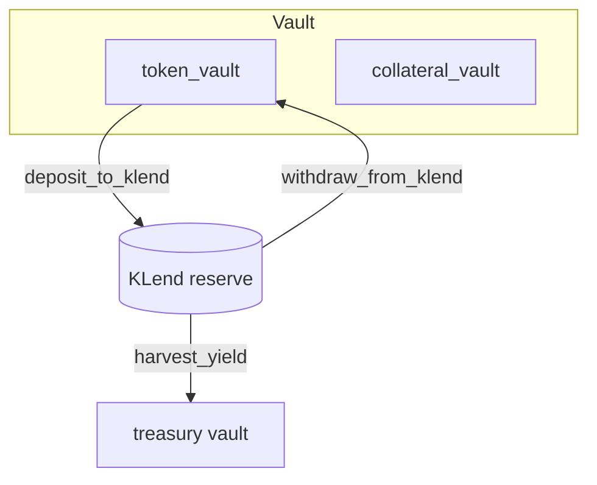

# Olympus Complex — Architecture & Design Philosophy

## Purpose

Olympus Complex is a Solana protocol that issues a **yield-bearing wrapped stablecoin (Florin (FLRN))** backed 1:1 by registered collateral (USDC at launch). Users deposit collateral and receive Florin (FLRN); underlying assets can be supplied to **Kamino KLend** to earn yield. Yield accrues to per-asset treasury vaults controlled by the protocol, not to Florin (FLRN) supply.

**Core value proposition:** Deposit stables → receive Florin (FLRN) → protocol captures KLend yield to treasury; redemptions draw from backing vaults at 1:1.

Flash mint is **not compiled into the shipped program**. See [../wiki/Flash-mint.md](../wiki/Flash-mint.md) for the experimental, feature-gated design preserved for optional future market-making.

---

## Branding vs protocol

> **Florin is a presentation-layer identity.** Protocol identifiers (`wrapped_mint`, `wrappedMint`, PDA seeds, account names, package names, APIs, and state fields) remain stable indefinitely. Branding may change without affecting protocol compatibility or on-chain state.

| Layer | Examples |
|-------|----------|
| **Brand** | Florin, FLRN, `branding/florin.json`, Metaplex metadata |
| **Protocol** | `wrapped_mint`, `WRAPPED_MINT_SEED`, `wrappedMint` API fields |
| **Governance** | Metadata update authority, CLI `metadata update-uri` |

Canonical token name/symbol/decimals for runtime display come from on-chain Metaplex metadata via the backend API.

---

## Design Philosophy

### 1. Composability over isolation

The on-chain program is intentionally thin. KLend handles lending; the backend (off-chain) routes non-backing inputs through Jupiter and bundles them with `wrap` / `unwrap` into a single user-signed transaction. The on-chain program never CPIs into Jupiter.

### 2. Multi-asset collateral, single Florin (FLRN) mint

Each registered asset has its own vaults and optional KLend wiring. Off-chain swap aggregation lets users enter/exit via tokens other than the backing asset while on-chain accounting stays per-asset.

### 3. Authority-centric configuration with rotatable admin

Each vault is keyed by an immutable **authority** (the PDA-seed creator). A separate, rotatable **admin** field controls operational policy: pause, treasury, allowlist, asset policy. Admin transfer is a two-step propose/accept flow.

### 4. Security through constraints

- **CPI-as-oracle harvest** — `harvest_yield` derives the kToken→collateral rate from the redeem CPI itself; KLend's downward rounding makes the residual-backing check strictly conservative.
- **Pinned KLend accounts** — reserve and market accounts bound at `enable_klend` and pinned by `address` constraints on every later CPI.
- **Allowlist PDA validation** — `check_access` re-derives the allowlist address from `(vault_config, bump)`, blocking foreign allowlists.
- **Pause** — emergency stop covers wrap, unwrap, deposit/withdraw KLend, and harvest.

### 5. Yield to treasury, not to wrapped supply

Florin (FLRN) supply tracks deposited collateral 1:1. Lending yield accumulates in KLend kTokens; the admin redeems surplus into the asset treasury via `harvest_yield`. Florin (FLRN) redemption value does not float above 1:1 from yield accrual.

---

## Account Topology

Related types: `VaultConfig`, `AssetConfig`, `KLendConfig`, `Allowlist`.

`VaultConfig` carries immutable `authority`, rotatable `admin`/`pending_admin`, wrapped mint, registered assets, `total_stable_deposited`, and policy flags. Four `flash_*` fields are **reserved layout** (initialized to safe defaults; unused in shipped build).

`AssetConfig` (seed `token_config`) pins per-asset mint, vaults, treasury, decimals, caps, and KLend enablement.

### PDA seeds

| PDA | Seeds | Role |
| --- | --- | --- |
| `vault_config` | `["vault_config", authority]` | Vault state, admin policy |
| `vault_authority` | `["vault_authority", vault_config]` | Signer for token + KLend CPIs |
| `wrapped_mint` | `["wrapped_mint", vault_config]` | Florin (FLRN) mint |
| `asset_config` | `["token_config", vault_config, token_mint]` | Per-asset registry |
| `token_collateral_vault` | `["token_collateral_vault", asset_config]` | KLend kToken vault |
| `token_vault` | `["token_vault", asset_config]` | Free collateral vault |
| `treasury_vault` | `["treasury_vault", asset_config]` | Yield recipient |
| `klend_config` | `["klend_config", asset_config]` | Pinned KLend accounts |
| `allowlist` | `["allowlist", vault_config]` | Optional gate for non-public IO |

---

## High-Level Flows

### Wrap

```mermaid
flowchart LR
    User -->|collateral transfer_checked| TokenVault[token_vault]
    Program -->|mint 1:1 of received| UserWStable[user Florin (FLRN) ATA]
    Program -. updates .-> Totals[totals]
```

Wrap snapshots vault balance before and after transfer, then mints Florin (FLRN) on the **delta received**.

### Unwrap

```mermaid
flowchart LR
    User -->|Florin (FLRN)| Burn((burn))
    TokenVault[token_vault] -->|collateral 1:1| User
    Program -. updates .-> Totals
```

Unwrap requires `token_vault` to hold enough free collateral. Admin calls `withdraw_from_klend` first if liquidity sits in KLend.

### Admin liquidity flow



`harvest_yield` enforces a conservative residual-backing invariant from the redeem CPI rate.

---

## Key Components

### Vault initialization

`initialize` creates `vault_config`, `wrapped_mint`, and `vault_authority`. Collateral is registered via `add_asset`; KLend is wired per asset with `enable_klend`.

### Wrap / Unwrap

Gated by `paused`, `check_access` (admin-bypass + optional allowlist), and per-asset policy from `update_asset_policy`.

### Admin liquidity management

`deposit_to_klend`, `withdraw_from_klend`, and `harvest_yield` are admin-only. KLend CPI accounts are pinned at `enable_klend`.

### Allowlist

Single allowlist per vault, capped at 64 entries. `check_access` re-derives the expected PDA.

### Two-step admin transfer

`transfer_authority` records `pending_admin`; `accept_authority` requires the pending key to sign. Immutable `authority` (PDA seed) is unchanged.

---

## External Dependencies

| Dependency | Role |
| --- | --- |
| **KLend** | Lending via CPI |
| **SPL Token / Token-22** | Mint, transfer_checked, burn |
| **Jupiter** *(backend)* | Off-chain swap aggregation via `/v1/tx/compose` |

---

## Security Model

| Threat | Mitigation |
| --- | --- |
| Foreign-allowlist bypass | PDA re-derivation in `check_access` |
| Fee-on-transfer over-mint | Mint on vault delta, not claimed amount |
| Admin under-backing via harvest | Residual-backing invariant from CPI rate |
| Reserve substitution post-init | KLend accounts pinned at `enable_klend` |
| Unauthorized admin actions | `has_one = admin` on admin instructions |
| Reflexive collateral | Florin (FLRN) cannot back itself |

---

## Deploy note

**Folkmoot and production use the default build only:**

```bash
anchor build   # no --features flash-mint
```

---

## Summary

Olympus Complex is a **multi-asset collateral wrapper** that:

1. Mints Florin (FLRN) 1:1 against registered assets and supplies principal to KLend when enabled.
2. Routes lending yield to per-asset treasury vaults; Florin (FLRN) supply stays at par.
3. Separates immutable `authority` from rotatable `admin`.
4. Defers swap aggregation to the backend Jupiter bundler.
5. Ships without flash mint (see [Flash-mint.md](../wiki/Flash-mint.md) for experimental re-enable path).
