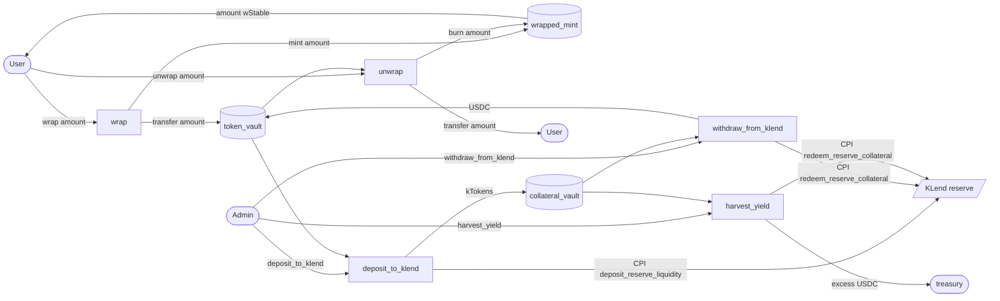

# wStable — Kamino KLend wrapped stablecoin

A Solana program that mints a wrapped stablecoin (wStable) 1:1 against USDC. User deposits stay in an intermediate vault until the admin moves them into Kamino KLend to earn yield. Excess yield above user-backed collateral can be harvested to a treasury.

Program ID: `5JmAnBvF8akh9N36bqoxZdAsyv4SeW6oNedJpj3WUSoT`

## Flow



The design splits user-facing flows from KLend interaction. `wrap` and `unwrap` only burn/mint wStable and move USDC between user and `token_vault`. The admin rebalances between `token_vault` and KLend via `deposit_to_klend` / `withdraw_from_klend`, and skims yield via `harvest_yield`. This means users can always unwrap as long as `token_vault` holds enough USDC; admins are responsible for keeping reserves high enough to service redemptions.

## Accounts

- **VaultConfig** — global config (authority, admin, pending_admin, treasury, wrapped_mint, lending_market, usdc_mint, flags, flash-mint params).
- **TokenConfig** — per-reserve config; currently a single instance (base USDC). Tracks `total_deposited` (user principal in USDC held in `token_vault`) and `total_liquidity_in_klend` (USDC-denominated liability deposited into KLend). `harvest_yield` uses an admin-supplied conservative kToken exchange rate to derive the kToken count that must remain as backing; anything above that is yield.
- **Allowlist** — optional list of pubkeys permitted to wrap/unwrap when the vault is private.
- **FlashLoanState** — transient PDA created by `flash_mint_start` and required by `flash_mint_end` to close a flash mint.

## Access control

Two permission axes:

1. **Admin / authority split.** `authority` is set at init and used only as the immutable PDA seed root. `admin` is mutable and gates every privileged instruction (pause, treasury update, KLend movement, harvest, flash-mint config). Admin is rotated via a two-step `transfer_authority` → `accept_authority` flow.
2. **Public vs allowlist.** `wrap_public` and `unwrap_public` flags control whether arbitrary users can wrap or unwrap. When a flag is false, the caller must either be the admin or present an `Allowlist` PDA that contains their pubkey.

## Flash mint

`flash_mint_start` mints wStable to a borrower and writes a transient `FlashLoanState`. `flash_mint_end` must run in the same transaction — it verifies the borrower holds `amount + fee`, burns the principal, and transfers the fee to the treasury. Transaction-introspection in `flash_mint_start` confirms the matching `flash_mint_end` is present before minting.

Knobs: `flash_mint_enabled`, `flash_mint_fee_bps` (max 10000), and `flash_mint_max_amount` (0 = no cap).

## Layout

- `wrap-stablecoin/programs/kamino-tester/` — on-chain Anchor program.
- `backend/` — Rust HTTP service that builds transactions for the frontend.
- `frontend/` — Next.js app (wallet adapter, wrap/unwrap UI).

## Build & test

```bash
# Build the program
cd wrap-stablecoin && anchor build

# Run integration tests (local validator)
cd wrap-stablecoin && anchor test
```

End-to-end testing against live KLend requires forking devnet or mainnet reserves — local `init_reserve` leaves `deposit_limit = 0` and has no oracle.
