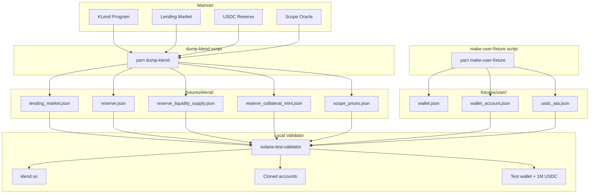

# Florin (FLRN) — Kamino KLend wrapped stablecoin

A Solana program that mints a wrapped stablecoin (Florin (FLRN)) 1:1 against USDC. User deposits stay in an intermediate vault until the admin moves them into Kamino KLend to earn yield. Excess yield above user-backed collateral can be harvested to a treasury.

> New to Florin? Start with **[docs/HOW_IT_WORKS.md](docs/HOW_IT_WORKS.md)** — a plain-language explainer with flowcharts.

Program ID: `DUKXaKc4q6DXKf6mB13iyAB5vgBRvMH8WC2qy3RGUqSJ`

## Flow

```mermaid
flowchart LR
    U([User]) -->|wrap amount| WR[wrap]
    WR -->|transfer amount| TV[(token_vault)]
    WR -->|mint amount| WM[(wrapped_mint)]
    WM -->|amount Florin (FLRN)| U

    A([Admin]) -->|deposit_to_klend| DTK[deposit_to_klend]
    DTK -->|CPI deposit_reserve_liquidity| KL[/KLend reserve/]
    TV --> DTK
    DTK -->|kTokens| CV[(collateral_vault)]

    A -->|withdraw_from_klend| WTK[withdraw_from_klend]
    WTK -->|CPI redeem_reserve_collateral| KL
    CV --> WTK
    WTK -->|USDC| TV

    U -->|unwrap amount| UW[unwrap]
    UW -->|burn amount| WM
    UW -->|transfer amount| U2([User])
    TV --> UW

    A -->|harvest_yield| HY[harvest_yield]
    HY -->|CPI redeem_reserve_collateral| KL
    CV --> HY
    HY -->|excess USDC| TR([treasury])
```

The design splits user-facing flows from KLend interaction. `wrap` and `unwrap` only burn/mint Florin (FLRN) and move USDC between user and `token_vault`. The admin rebalances between `token_vault` and KLend via `deposit_to_klend` / `withdraw_from_klend`, and skims yield via `harvest_yield`. This means users can always unwrap as long as `token_vault` holds enough USDC; admins are responsible for keeping reserves high enough to service redemptions.

## Accounts

- **VaultConfig** — global config (authority, admin, pending_admin, wrapped mint, flags). Collateral membership is per-`AssetConfig` PDA (no mint list on the vault). Four `flash_*` fields are reserved layout (unused in shipped build). Discriminator pinned to `b"vaultcf2"`; a vault created before the asset-registry removal is unreadable and needs a fresh `authority` (see `ARCHITECTURE.md`).
- **AssetConfig** — per-collateral registry (seed `token_config`): vaults, treasury, caps, KLend wiring, and deposit/liquidity totals.
- **Allowlist** — optional list of pubkeys permitted to wrap/unwrap when the vault is private.

Flash mint (`FlashLoanState`, flash instructions) is **not compiled** in the default build. See [../wiki/Flash-mint.md](../wiki/Flash-mint.md).

## Access control

Two permission axes:

1. **Admin / authority split.** `authority` is set at init and used only as the immutable PDA seed root. `admin` is mutable and gates every privileged instruction (pause, treasury update, KLend movement, harvest, asset policy). Admin is rotated via a two-step `transfer_authority` → `accept_authority` flow.
2. **Public vs allowlist.** `wrap_public` and `unwrap_public` flags control whether arbitrary users can wrap or unwrap. When a flag is false, the caller must either be the admin or present an `Allowlist` PDA that contains their pubkey.

## Layout

- `wrap-stablecoin/programs/wrap-stablecoin/` — on-chain Anchor program.
- `backend/` — Rust HTTP service that builds transactions for the frontend.
- `frontend/` — Next.js app (wallet adapter, wrap/unwrap UI).

## Build & test

```bash
# Shipped build (Folkmoot / production — no flash mint in binary or IDL)
cd wrap-stablecoin && anchor build

# Run integration tests (local validator)
cd wrap-stablecoin && anchor test
```

Experimental flash-mint build (repo only, not for listing): `anchor build -- --features flash-mint`. See [../wiki/Flash-mint.md](../wiki/Flash-mint.md).

## Local development (persistent localnet)

For interactive dev against KLend with a **persistent** validator (not `anchor test`):

```bash
cd wrap-stablecoin
cp .env.example .env    # first time only
yarn install
anchor run local        # validator + seed + print env block (leave this terminal open)
```

Stop: `anchor run stop-local` (alias: `anchor run local-stop`) — see [kill.md](kill.md)

The validator runs as a **background job** in that terminal (`&`); slot logs keep printing while the tab stays open.

See [../wiki/Local-development.md](../wiki/Local-development.md) for full reference (Kamino fixtures, env vars, backend/frontend setup).

## Deploying to devnet / mainnet

One CLI ([`cli/`](cli/)) covers deploy, vault bootstrap, and env rendering. Every
command except `check-idl` takes `--network`. Re-runs differ per command: `init`
and `metadata initialize` skip what already exists (`init` first checks existing
accounts against the requested parameters), `deploy` rebuilds and upgrades an
existing program on every run, `sync-env` rewrites the env files, and `metadata update-uri` /
`revoke-authority` send a transaction on every run.

```bash
export DEPLOYER_WALLET_DEVNET=<deployer keypair>   # deploy only
export ANCHOR_WALLET_DEVNET=<vault admin keypair>  # init, metadata
pnpm cli deploy   --network devnet
pnpm cli init     --network devnet --decimals-mint <mint> --reserve <klend-reserve>
pnpm cli sync-env --network devnet
pnpm cli metadata initialize --network devnet
```

| Command | Does |
|---------|------|
| `deploy` | `anchor build`, then `anchor deploy` or `anchor upgrade` depending on whether the program id already exists on the cluster |
| `init` | `initialize` → `add_asset` → `enable_klend`, skipping any step whose account exists once it matches the requested parameters, then writes `deployments/<network>.json` |
| `sync-env` | Renders `backend/.env` + both `.env.local` files from that artifact |
| `metadata` | Florin mint metadata (see [../branding](../branding)) |

Further collateral is a second `init --asset <mint> --reserve <reserve>`, or the
Reserves page in the admin console (`POST /v1/admin/register-asset`).

`--reserve` is the only Kamino input: the reserve's market, liquidity supply, and
kToken mint are read off the account ([`cli/klend.ts`](cli/klend.ts)) and
re-validated on-chain by `enable_klend`.

### CLI environment

Resolved in [`cli/network.ts`](cli/network.ts). Each key is read as
`{KEY}_{LOCALNET|DEVNET|MAINNET}`; the unscoped `{KEY}` is a fallback on localnet
only. Values come from the shell or CI environment: `pnpm cli` does not load a
`.env` file, and `wrap-stablecoin/.env` is only sourced by `anchor run local`.
Wallet paths may be relative to `wrap-stablecoin/`.

| Key | Read by | localnet | devnet | mainnet |
|-----|---------|----------|--------|---------|
| `RPC_URL` | `deploy`, `init`, `metadata` | `ANCHOR_PROVIDER_URL`, else `http://127.0.0.1:${RPC_PORT:-8901}` | `https://api.devnet.solana.com` | required |
| `CLIENT_RPC_URL` | `init` (recorded for `sync-env`) | resolved `RPC_URL` | resolved `RPC_URL` | required |
| `ANCHOR_WALLET` | `init`, `metadata` (vault admin) | fixture `admwu2g9...` | required | required |
| `DEPLOYER_WALLET` | `deploy` (upgrade authority) | fixture `depxPDoQ...` | required | required |

`sync-env` reads none of these; it renders from `deployments/<network>.json`.
`scripts/seed_localnet.ts` resolves the localnet `RPC_URL`, `ANCHOR_WALLET`, and
`DEPLOYER_WALLET` the same way.

### Safety rails

- `--dry-run` resolves every address and prints the steps without sending anything.
- Mainnet writes need `--confirm`.
- Fixture keypairs are localnet-only: the admin fixture's secret key is committed
  (`fixtures/user/wallet.json`), so devnet and mainnet refuse to fall back to it
  (see [CLI environment](#cli-environment)). The devnet-e2e scripts are the one
  exception and opt into the fixture admin themselves.
- Mainnet has no default RPC, and the browser-facing `CLIENT_RPC_URL_MAINNET` is
  kept apart from `RPC_URL_MAINNET`: `sync-env` writes it to `backend/.env`,
  which serves it to every browser via `GET /v1/client-config`, while a mainnet
  deploy RPC is a private provider URL with an API key.
- Only localnet reads unscoped keys: `anchor run`/`anchor test` export
  `ANCHOR_WALLET` and `ANCHOR_PROVIDER_URL` for localnet, and a stray
  `ANCHOR_WALLET` or `RPC_URL` from another shell can never sign for or point at
  devnet or mainnet.
- `deploy` checks the right key for the path it takes. A **first deploy** aborts
  unless `target/deploy/wrap_stablecoin-keypair.json` matches `declare_id!` —
  `anchor build` mints a fresh keypair whenever that file is missing, and
  publishing under it would move the program away from the address every PDA
  derives from. An **upgrade** never reads that file; it aborts unless the
  deployer wallet is the program's on-chain upgrade authority.
- The program's **upgrade authority** is the `deploy` signer
  (`DEPLOYER_WALLET_*`), never the vault admin that `init` signs with. Point it
  at a multisig before mainnet; the vault admin rotates separately on-chain via
  `transfer_authority` / `accept_authority`. `deploy` can upgrade only while
  `DEPLOYER_WALLET_*` holds the upgrade-authority key; once a multisig holds it,
  upgrades go outside the CLI: `solana program write-buffer`, then
  `solana program set-buffer-authority` to the multisig, then the multisig's
  upgrade proposal.

## Running E2E tests locally

The e2e tests run against cloned mainnet KLend state, allowing full CPI integration without depending on live RPC at test time.

### Prerequisites

| Tool | Version | Install |
|------|---------|---------|
| Rust | 1.75+ | [rustup.rs](https://rustup.rs/) |
| Solana CLI | 1.18+ | `sh -c "$(curl -sSfL https://release.solana.com/v1.18.18/install)"` |
| Anchor CLI | 0.31+ | `cargo install --git https://github.com/coral-xyz/anchor anchor-cli` |
| Node.js | 18+ | [nodejs.org](https://nodejs.org/) |
| Yarn | 1.x | `npm install -g yarn` |

### Setup

```bash
cd wrap-stablecoin

# Install JS dependencies
yarn install

# Build the Anchor program
anchor build
```

### Run tests

```bash
anchor test
```

This starts a local validator with the KLend fixtures pre-loaded, deploys the program, and runs all e2e tests.

### How the fixtures work



The test validator loads:
- **KLend program** (`so/klend.so`) - mainnet bytecode
- **KLend accounts** (`fixtures/klend/`) - lending market, reserve, oracle prices
- **Test wallet** (`fixtures/user/`) - keypair with 100 SOL + 1M USDC ATA

The validator warps to the slot recorded in `Anchor.toml` (`warp_slot`) so reserve timestamps pass KLend's staleness checks.

### Regenerating fixtures

Fixtures may become stale if KLend upgrades or reserve state drifts too far. To refresh:

```bash
# 1. Dump fresh KLend state from mainnet (requires RPC access)
yarn dump-klend

# 2. Regenerate test wallet fixtures (or reuse existing wallet)
yarn make-user-fixture

# 3. Update warp_slot in Anchor.toml to match fixtures/klend/slot.txt
```

Environment overrides for `dump-klend`:
- `RPC_URL` - mainnet RPC endpoint (default: public mainnet-beta)
- `MARKET` - lending market pubkey (default: Kamino Main Market)
- `MINT` - reserve liquidity mint (default: USDC)

### Troubleshooting

| Issue | Cause | Fix |
|-------|-------|-----|
| `Reserve is stale` | `warp_slot` too far from fixture snapshot | Re-run `yarn dump-klend` and update `warp_slot` |
| `Insufficient funds` | Test wallet ATA missing or empty | Re-run `yarn make-user-fixture` |
| `Program not found` | KLend bytecode missing | Ensure `so/klend.so` exists (download from mainnet or build) |
| `Account not found` | Fixture file missing | Check `fixtures/klend/` has all required JSONs |
