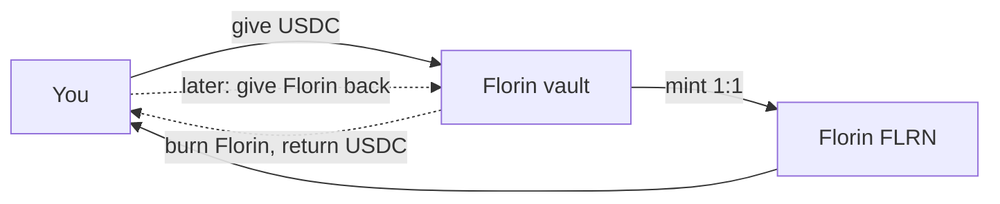
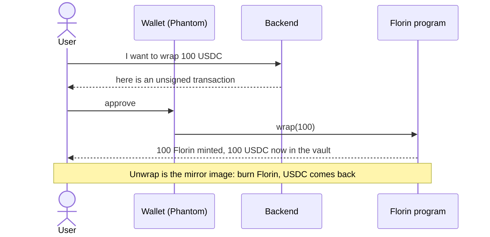
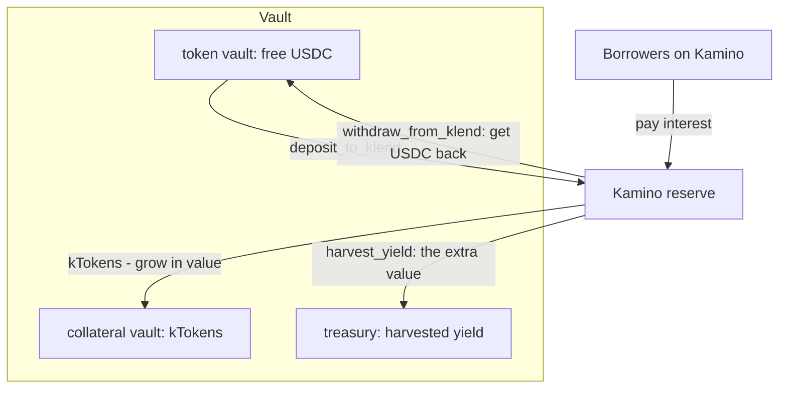
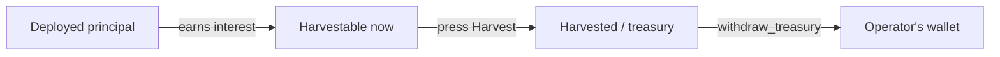
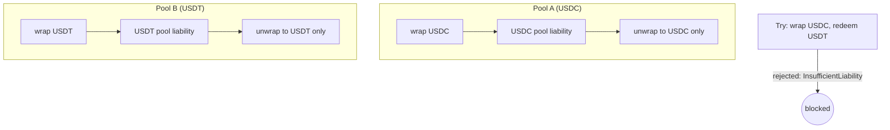
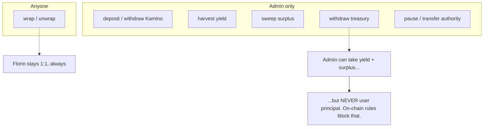
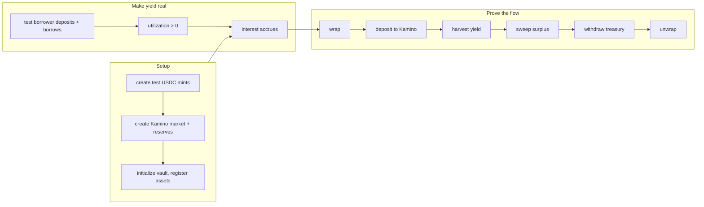

# How Florin works (the simple version)

A plain-language tour of what this program does and why. For the exact accounts,
instructions, and invariants, see [`ARCHITECTURE.md`](../ARCHITECTURE.md).

## The one-sentence idea

You hand in a stablecoin (like USDC), you get back **Florin (FLRN)** 1-for-1. Your USDC
sits safely in a vault, and while it waits it can earn a little yield in Kamino. Whenever
you want, you hand back Florin and get your USDC out.

Think of a **coat check**: you give the attendant your coat, you get a ticket. The ticket
is always worth exactly one coat. You can hand the ticket back any time for your coat.
Florin is the ticket; your USDC is the coat.

## Wrap and unwrap (the everyday actions)

- **Wrap** = deposit USDC, get Florin. ("Mint" in the UI.)
- **Unwrap** = give Florin back, get USDC. ("Redeem" in the UI.)

The backend only **builds** the transaction; **you** sign it in your wallet. The program
never over-mints: it mints exactly the USDC it actually received.

## Where does your USDC sit, and where does yield come from?

Your USDC lives in the vault's **token vault**. To earn a bit of yield, an admin can move
idle USDC into **Kamino** (a lending market). Kamino pays interest **because other people
borrow** from it. The vault's share of that interest is the yield.

- **deposit_to_klend** — park USDC in Kamino, receive kTokens (a receipt that slowly grows
  in value as interest builds).
- **harvest_yield** — the kTokens are now worth more than what was deposited; that *extra*
  is skimmed into the **treasury**.
- **withdraw_from_klend** — pull USDC back out of Kamino so people can unwrap.
- **withdraw_treasury** — move harvested yield out of the treasury to the operator.

Important: **holders don't get the yield.** One Florin is always worth one USDC. The yield
is a separate pot (the treasury). Florin stays at par.

## "Yield earned" — what the numbers mean

The admin Yield page shows, per collateral:

| Column | Plain meaning |
|---|---|
| **Deployed** | how much USDC is currently working in Kamino |
| **Harvestable now** | yield earned but not yet collected — you *can take this now* |
| **Home surplus** | extra USDC in the vault beyond what's owed to holders |
| **Harvested** | yield already moved into the treasury |
| **Total earned** | all of the above added up |

The **%** is "yield so far" against the deployed principal.

## Many coats, many tickets: the per-pool rule

Florin can accept several different stablecoins (up to 8). Each one has its **own pool**
and its own book of who's owed what. The key rule: **you can only get back the same coin
you put in.** Wrapping USDC does not let you redeem USDT — each pool only pays out its own.

This is what stops someone from swapping cheaply through the vault or draining one pool
using another pool's deposits.

## Who can do what

Even a fully-trusted (or fully-compromised) admin can only ever reach the **yield and
surplus**. The USDC backing your Florin cannot be pulled out to the admin by any
instruction — the worst an admin can do is pause the system or hand off control, and you
can always unwrap and leave.

## How the devnet test proves all this

On devnet we can't rely on real borrowers, so the test creates its own:

The **test borrower** is not part of the product — it's a fake customer that borrows on
Kamino so there's interest to earn. On mainnet, real borrowers do this automatically, so no
test borrower is needed. See [`scripts/devnet-e2e/README.md`](../scripts/devnet-e2e/README.md)
for how to run the whole thing.
