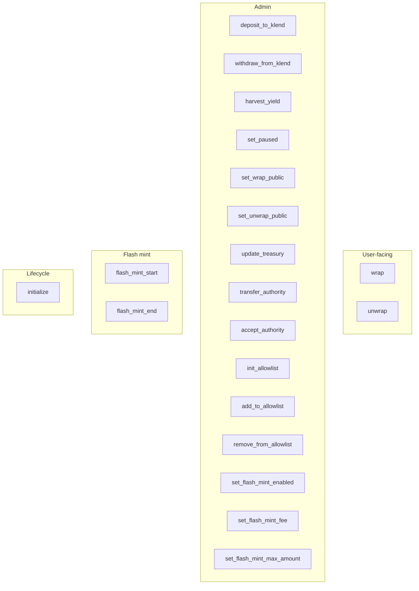

# kamino-tester

Anchor program implementing wStable — a USDC-backed wrapped token with Kamino KLend as the yield source. See [../../README.md](../../README.md) for the high-level flow and design.

Program ID: `5JmAnBvF8akh9N36bqoxZdAsyv4SeW6oNedJpj3WUSoT`

## Architecture



## PDAs

| PDA | Seeds | Purpose |
|---|---|---|
| `vault_config` | `["vault_config", authority]` | Global config |
| `vault_authority` | `["vault_authority", vault_config]` | Signs token + CPI operations |
| `wrapped_mint` | `["wrapped_mint", vault_config]` | wStable mint |
| `token_config` | `["token_config", vault_config, usdc_mint]` | Base token config |
| `token_collateral_vault` | `["token_collateral_vault", token_config]` | Holds kTokens |
| `token_vault` | `["token_vault", token_config]` | Holds USDC between user flows and KLend moves |
| `allowlist` | `["allowlist", vault_config]` | Access list (optional) |
| `flash_loan` | `["flash_loan", borrower, vault_config]` | Transient flash-mint state |

## State

### VaultConfig

| Field | Type | Notes |
|---|---|---|
| `authority` | `Pubkey` | Immutable; PDA seed root |
| `admin` | `Pubkey` | Operational admin; `has_one` gate on privileged ix |
| `pending_admin` | `Pubkey` | Set by `transfer_authority`; cleared on `accept_authority` |
| `treasury` | `Pubkey` | Yield recipient; flash-mint fee receiver owner |
| `wrapped_mint`, `lending_market`, `usdc_mint` | `Pubkey` | Fixed at init |
| `wrapped_mint_bump`, `vault_authority_bump`, `bump` | `u8` | PDA bumps |
| `total_stable_deposited` | `u64` | Aggregate user wStable liability |
| `paused` | `bool` | Hard gate on wrap / unwrap / admin KLend ops |
| `wrap_public`, `unwrap_public` | `bool` | If false, require admin or allowlist |
| `flash_mint_enabled` | `bool` | Public flash-mint toggle |
| `flash_mint_fee_bps` | `u16` | Fee charged on flash-mint principal (max 10000) |
| `flash_mint_max_amount` | `u64` | Per-flash cap; `0` = no limit |

### TokenConfig

| Field | Type | Notes |
|---|---|---|
| `token_mint`, `token_decimals` | `Pubkey`, `u8` | Base token (USDC) |
| `reserve`, `collateral_mint`, `reserve_liquidity_supply` | `Pubkey` | Pinned KLend accounts; enforced in admin CPI |
| `collateral_vault`, `token_vault` | `Pubkey` | Program-owned token accounts |
| `total_deposited` | `u64` | User-owned USDC (wrap adds, unwrap subtracts) |
| `total_liquidity_in_klend` | `u64` | USDC-denominated liability sitting in KLend; `deposit_to_klend` adds `amount`, `withdraw_from_klend` saturating-subtracts the actual USDC returned |
| `is_base_token`, `enabled` | `bool`, `bool` | Feature flags |

`harvest_yield` computes `backing_needed_kTokens = ceil(total_liquidity_in_klend * 10000 / min_ktoken_rate_bps)` from the caller-supplied conservative exchange rate, then caps the harvest at `collateral_vault.amount - backing_needed_kTokens`.

## Instructions

### Lifecycle

**`initialize`** — creates `vault_config`, `wrapped_mint`, `token_config`, `collateral_vault`, `token_vault`. Signer becomes both `authority` and initial `admin`. `wrapped_mint` inherits USDC decimals.

### User flows

**`wrap(amount)`** — requires `!paused`, `wrap_public || caller == admin || caller in allowlist`, enabled token config. Transfers `amount` USDC user → `token_vault`, mints `amount` wStable to user, adds to `total_deposited` and `total_stable_deposited`.

**`unwrap(amount)`** — requires `!paused`, `unwrap_public || caller == admin || caller in allowlist`. Burns `amount` wStable from user, requires `token_vault.amount >= amount`, transfers `amount` USDC vault → user, subtracts from `total_deposited` and `total_stable_deposited`. Fails with `InsufficientLiquidity` if the vault does not hold enough USDC — the admin must pre-fund via `withdraw_from_klend`.

### Admin — KLend rebalancing

**`deposit_to_klend(amount)`** — admin-only. CPIs `deposit_reserve_liquidity` with `token_vault → reserve_liquidity_supply` and increments `total_liquidity_in_klend` by `amount` (USDC deposited).

**`withdraw_from_klend(collateral_amount)`** — admin-only. Snapshots `token_vault.amount` before and after the `redeem_reserve_collateral` CPI to measure actual USDC returned, then saturating-subtracts that USDC delta from `total_liquidity_in_klend`. Saturation absorbs rate appreciation cleanly: when kTokens have appreciated, the USDC returned can exceed the originally-tracked principal, which is fine — the surplus is extra vault backing.

**`harvest_yield(collateral_amount, min_ktoken_rate_bps)`** — admin-only. The `min_ktoken_rate_bps` argument is the admin-attested conservative (i.e., no higher than current) kToken:USDC exchange rate in basis points (10000 = 1.00x). Derives `backing_needed_kTokens = ceil(total_liquidity_in_klend * 10000 / min_ktoken_rate_bps)` and caps the harvest at `collateral_vault.amount - backing_needed_kTokens` (fails with `ExceedsHarvestableYield` otherwise). Admin is trusted to supply a truthful lower bound on the rate; the signer + `has_one` gate is the guarantee.

### Admin — configuration

- `set_paused(paused)`
- `set_wrap_public(wrap_public)`, `set_unwrap_public(unwrap_public)`
- `update_treasury` — new treasury passed as unchecked account
- `transfer_authority` — writes `pending_admin`
- `accept_authority` — signed by `new_admin`; requires `pending_admin == new_admin`; clears `pending_admin`
- `init_allowlist`, `add_to_allowlist(pubkey)`, `remove_from_allowlist(pubkey)`
- `set_flash_mint_enabled`, `set_flash_mint_fee(fee_bps)`, `set_flash_mint_max_amount(max_amount)`

### Flash mint

**`flash_mint_start(amount)`** — requires `flash_mint_enabled || borrower == admin`, and `amount <= flash_mint_max_amount` when the cap is non-zero. Uses instruction-sysvar introspection to confirm a matching `flash_mint_end` is present later in the transaction, then mints `amount` wStable to the borrower and writes a `FlashLoanState`.

**`flash_mint_end`** — requires `borrower_wrapped.amount >= amount + fee`, burns `amount`, transfers `fee` to `fee_receiver` (constrained to `mint == wrapped_mint` and `owner == treasury`). The `FlashLoanState` PDA closes implicitly via its `init` constraint in `flash_mint_start` preventing double-mint.

## Error codes

Defined in `src/errors.rs`. Notable ones:

| Code | Scenario |
|---|---|
| `VaultPaused` | `paused == true` |
| `Unauthorized` | `has_one = admin` failed |
| `NotAllowedToWrap` / `NotAllowedToUnwrap` | Caller not admin and not on allowlist while flag is private |
| `InsufficientLiquidity` | `unwrap` when `token_vault` is under-funded |
| `ExceedsHarvestableYield` | `harvest_yield` over the excess-collateral cap |
| `FlashMintDisabled` / `FlashMintAmountExceeded` | Flash-mint gating |
| `MissingFlashMintEnd` / `InsufficientRepayment` | Flash-mint lifecycle violations |
| `NoPendingTransfer` | `accept_authority` called with no pending transfer |

## Tests

```bash
anchor test
```

`integration_test.rs` stands up a local KLend market + reserve and exercises the CPI wiring. Full E2E (user wrap → admin deposit → accrual → admin harvest → user unwrap) requires a reserve with a working oracle and non-zero deposit limit, which local `init_reserve` does not provide; fork devnet/mainnet for that.
