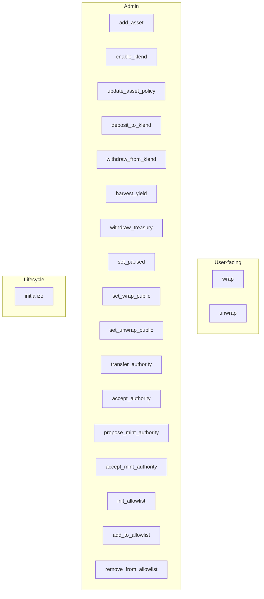

# wrap-stablecoin

Anchor program implementing Florin (FLRN) — a collateral-backed wrapped token with optional Kamino KLend yield. See [../../README.md](../../README.md) for the high-level flow and design.

Program ID: `5JmAnBvF8akh9N36bqoxZdAsyv4SeW6oNedJpj3WUSoT`

**Shipped build:** default Cargo features (no flash mint). Flash mint code exists behind `--features flash-mint` only. See [../../../wiki/Flash-mint.md](../../../wiki/Flash-mint.md).

## Architecture



## PDAs

| PDA | Seeds | Purpose |
|---|---|---|
| `vault_config` | `["vault_config", authority]` | Global config |
| `vault_authority` | `["vault_authority", vault_config]` | Signs token + CPI operations |
| `wrapped_mint` | `["wrapped_mint", vault_config]` | Florin (FLRN) mint |
| `asset_config` | `["token_config", vault_config, token_mint]` | Per-asset config |
| `token_collateral_vault` | `["token_collateral_vault", asset_config]` | Holds kTokens |
| `token_vault` | `["token_vault", asset_config]` | Holds free collateral |
| `treasury_vault` | `["treasury_vault", asset_config]` | Yield recipient |
| `klend_config` | `["klend_config", asset_config]` | Pinned KLend accounts |
| `allowlist` | `["allowlist", vault_config]` | Access list (optional) |

## State

### VaultConfig

| Field | Type | Notes |
|---|---|---|
| `authority` | `Pubkey` | Immutable; PDA seed root |
| `admin` | `Pubkey` | Operational admin; `has_one` gate on privileged ix |
| `pending_admin` | `Pubkey` | Set by `transfer_authority`; cleared on `accept_authority` |
| `pending_mint_authority` | `Pubkey` | Set by `propose_mint_authority`; cleared on `accept_mint_authority` |
| `mint_authority_transferred` | `bool` | When true, `wrap` is permanently disabled |
| `wrapped_mint` | `Pubkey` | Florin (FLRN) mint |
| `wrapped_mint_bump`, `vault_authority_bump`, `bump` | `u8` | PDA bumps |
| `total_stable_deposited` | `u64` | Aggregate user Florin (FLRN) liability |
| `paused` | `bool` | Blocks wrap, unwrap, Kamino deposit, and harvest. Recall, sweep, and treasury still work |
| `wrap_public`, `unwrap_public` | `bool` | If false, require admin or allowlist |
| `flash_mint_*` (4 fields) | various | **Reserved** — unused in shipped build; see Flash-mint.md |

### AssetConfig

| Field | Type | Notes |
|---|---|---|
| `token_mint`, `token_decimals` | `Pubkey`, `u8` | Collateral mint |
| `token_vault`, `collateral_vault`, `treasury_vault` | `Pubkey` | Program-owned accounts |
| `total_deposited`, `total_liquidity_in_klend` | `u64` | Accounting for wrap/unwrap and KLend |
| Policy fields | various | Caps, haircuts, mint/redeem flags via `update_asset_policy` |

`harvest_yield` uses a conservative kToken exchange rate to cap harvestable yield above user backing.

## Instructions

### Lifecycle

**`initialize`** — creates `vault_config`, `wrapped_mint`, `vault_authority`. Register collateral with `add_asset`; wire KLend with `enable_klend`.

### User flows

**`wrap(amount)`** — transfers collateral to `token_vault`, mints Florin (FLRN) 1:1 on delta received.

**`unwrap(amount)`** — burns Florin (FLRN), transfers collateral from `token_vault`. Fails with `InsufficientLiquidity` if vault is under-funded.

### Admin — KLend rebalancing

**`deposit_to_klend`**, **`withdraw_from_klend`**, **`harvest_yield`** — admin-only KLend CPIs with pinned accounts from `enable_klend`.

### Admin — configuration

- `set_paused`, `set_wrap_public`, `set_unwrap_public`
- `update_asset_policy`, `withdraw_treasury`
- `transfer_authority` / `accept_authority`
- `propose_mint_authority` / `cancel_propose_mint_authority` / `accept_mint_authority` — two-step SPL mint authority extraction; see [../../../wiki/Mint-authority-migration.md](../../../wiki/Mint-authority-migration.md)
- `init_allowlist`, `add_to_allowlist`, `remove_from_allowlist`

Flash-mint instructions exist only with `--features flash-mint`.

## Error codes

Defined in `src/errors.rs`. Flash-related error variants remain in the enum for layout compatibility; flash instructions are not in the shipped IDL.

## Tests

```bash
# Default (shipped path)
anchor test

# Experimental flash integration test (requires running validator + ANCHOR_WALLET)
cargo test -p wrap-stablecoin --features flash-mint test_flash_mint
```

`integration_test.rs` exercises KLend CPI wiring locally. E2E tests in `tests/e2e.ts` cover the full shipped instruction surface.
