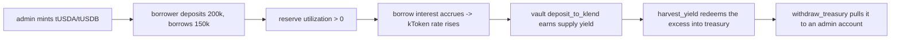

# dev-branch multi-asset devnet e2e

Runs the whole Florin (`wrap_stablecoin`) multi-asset stack against the **real KLend
program on devnet** (`KLend2g3cP87fffoy8q1mQqGKjrxjC8boSyAYavgmjD`), including real
KLend yield, the positive `harvest_yield` path, the per-pool liability guard, and the
treasury withdrawal path — none of which localnet cloned fixtures can reproduce.

Two test collaterals (tUSDA, tUSDB), one shared lending market, one KLend reserve per
collateral, a borrower per reserve to drive utilization so interest accrues.

## Yield flow



Reserve borrow curve is deliberately steep (500% APR at 0% utilization -> 1000% at 100%)
so measurable yield accrues in minutes. Price is the live devnet Pyth receiver USDC feed
`Dpw1EAVrSB1ibxiDQyTAW6Zip3J4Btk2x4SgApQCeFbX` (both stables peg ~$1).

## Prerequisites

- `.secrets/` in the monorepo root with the admin keypair
  (`admwu2g9...json`, a few devnet SOL) and deployer (`depxPDoQ...json`, ~6 SOL to deploy
  the 831 KB program). Never committed.
- `yarn install` in `wrap-stablecoin/` and `anchor build`. The freshly generated program
  keypair means `declare_id!` + `Anchor.toml` are updated to the deployed id
  `DUKXaKc4q6DXKf6mB13iyAB5vgBRvMH8WC2qy3RGUqSJ` (the committed `BZQaR9Bc` had no keypair).
- Build needs `~/.local/share/solana/install/active_release/bin` prefixed to PATH (the
  agave `cargo-build-sbf`; homebrew solana lacks it).

## Deploy the program

```bash
cd wrap-stablecoin
solana program deploy target/deploy/wrap_stablecoin.so \
  --program-id target/deploy/wrap_stablecoin-keypair.json \
  -u devnet -k ../.secrets/depxPDoQBS9JXgwVumiJeuaaSU9b8FaCRwEVTaGD1v9.json
```

## Run the on-chain e2e

| Step | Script | What it does |
|---|---|---|
| 1 | `10_setup_market.ts` | tUSDA + tUSDB mints (admin = mint authority), shared KLend market, one reserve each with pyth oracle + steep curve |
| 2 | `20_seed_vault.ts` | `initialize` -> `add_asset(A)` -> `enable_klend(A)` -> `add_asset(B)` -> `enable_klend(B)` |
| 3 | `30_borrower.ts A` / `30_borrower.ts B` | per-asset borrower: obligation, deposit 200k collateral, borrow 150k (utilization -> yield) |
| 4 | `40_flow_test.ts` | wrap A+B -> deposit_to_klend -> wait for yield -> harvest_yield (positive) -> per-pool guard (unwrap B beyond liability must fail) -> withdraw_all_from_klend -> sweep_home_surplus -> withdraw_treasury -> unwrap |

```bash
npx ts-node scripts/devnet-e2e/10_setup_market.ts
npx ts-node scripts/devnet-e2e/20_seed_vault.ts
npx ts-node scripts/devnet-e2e/30_borrower.ts A
npx ts-node scripts/devnet-e2e/30_borrower.ts B
npx ts-node scripts/devnet-e2e/40_flow_test.ts
```

All addresses land in `devnet-state.json`; every step is idempotent and reads it.

## Backend + admin console against devnet

`backend/.env` (devnet):

```
APP_ENV=local
SOLANA_RPC_URL=https://api.devnet.solana.com
SOLANA_NETWORK=devnet
PROGRAM_ID=DUKXaKc4q6DXKf6mB13iyAB5vgBRvMH8WC2qy3RGUqSJ
VAULT_AUTHORITY=admwu2g9WV2kdwTzjasLXTy7tWq3W15BrP4PE7UZJ5x
DEFAULT_ASSET_MINT=<tUSDA mint from devnet-state.json>
CLIENT_SOLANA_RPC_URL=https://api.devnet.solana.com
CLIENT_SOLANA_WS_URL=wss://api.devnet.solana.com
ADMIN_KEYPAIR_PATH=<abs path>/.secrets/admwu2g9...json
# One per KLend reserve — self-created devnet reserves are Pyth-based, so the oracle
# goes in refresh_reserve's pyth slot instead of the scope slot:
KLEND_PYTH_PRICES_<reserveA>=Dpw1EAVrSB1ibxiDQyTAW6Zip3J4Btk2x4SgApQCeFbX
KLEND_PYTH_PRICES_<reserveB>=Dpw1EAVrSB1ibxiDQyTAW6Zip3J4Btk2x4SgApQCeFbX
```

```bash
cd backend && cargo run                       # :8080, holds the admin key, signs /v1/admin/*
cd admin-frontend && echo 'NEXT_PUBLIC_BACKEND_URL=http://127.0.0.1:8080' > .env.local
pnpm install && node_modules/.bin/next dev -p 3002   # NOT `pnpm dev` — its deps-check crashes
```

Open `http://localhost:3002` — Treasury / Chamber / Yield / Token Stats. The **Yield** page
shows the yield-earned summary (deployed, harvestable now + %, home surplus, harvested,
total) and drives real server-signed admin ops (deploy/recall/harvest/sweep/withdraw).

Admin ops verified against devnet through the backend (`/v1/admin/*`, server-signed):
`deposit-to-klend`, `deposit-all-to-klend`, `withdraw-from-klend`, `harvest-yield`, and
`withdraw-treasury` (yield pulled from the treasury vault to an admin token account). The
same withdraws are also covered on-chain by `40_flow_test.ts`.

## Gotchas learned the hard way

- **Public devnet RPC rate-limits (429).** The klend-sdk makes many RPC calls; step 1 may
  need a rerun (idempotent) to finish the second reserve. A private RPC avoids this.
- **KLend deposit/borrow need exact refresh order** in the same tx:
  `[refresh_reserve, refresh_obligation, op]`, with the obligation's deposited reserves as
  `refresh_obligation` remaining accounts.
- **`borrowLimitOutsideElevationGroup` defaults to 0** = hard borrow block; set via a direct
  `update_reserve_config` (mode 44). The SDK config differ misses it.
- **klend-sdk v7 PDA helpers** take `(reserve, programId)` in that order and return
  `[address, bump]` tuples.
- **Pyth vs Scope oracle slot:** real mainnet reserves are Scope (oracle in slot 5); our
  self-created devnet reserves are Pyth (slot 2). The backend now switches slots per the
  `KLEND_PYTH_PRICES_<reserve>` env; without it admin KLend ops 400 with "missing Scope
  oracle".
- **Yield figure lags** to the reserve's last on-chain refresh; it advances whenever a
  KLend op refreshes the reserve. A simulate-based live mark is a future improvement.

## Security note

`/v1/admin/*` has **no auth** and CORS is permissive. Fine for an internal devnet test;
never expose the backend port publicly — anyone reaching it can `withdraw_treasury`,
`transfer_authority`, or `accept_mint_authority` (permanently disables wrap). On-chain rules
still bound admin to yield/surplus, never user principal.
