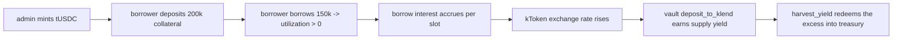

# Devnet full-stack test environment

Runs the whole wStable stack against the **real KLend program on devnet**
(`KLend2g3cP87fffoy8q1mQqGKjrxjC8boSyAYavgmjD` — Kamino maintains this deployment,
last updated one day after the mainnet build at the time of writing), including the
**positive `harvest_yield` path with real accrued interest**, which localnet fixtures
cannot produce.

## How yield is produced



The reserve's borrow curve is deliberately aggressive (500% APR at 0% utilization up
to 1000% at 100%), so measurable yield accrues in **minutes** of real devnet time.
Price comes from the live devnet Pyth receiver feed
`Dpw1EAVrSB1ibxiDQyTAW6Zip3J4Btk2x4SgApQCeFbX` (USDC/USD, ~$1.00).

## Prerequisites

- `.secrets/` in the monorepo root with the admin keypair
  (`admwu2g9...json`, needs a few devnet SOL) — never committed.
- `yarn install` in `wrap-stablecoin/` and `anchor build` (scripts read `target/idl/`).
- The program deployed on devnet as `HCrgCD3HkPXFF4CufxbvCVyfMhYJS8ZeLc6r5cLB9dNY`
  (upgrade authority: `depxPDoQ...`).

## Run everything

```bash
./scripts/devnet/run_devnet_bootstrap.sh
```

Or step by step:

| Script | What it does | Idempotent |
|---|---|---|
| `10_setup_market.ts` | Creates the tUSDC test mint (admin is mint authority), a KLend lending market owned by admin, a reserve with pyth oracle + aggressive curve | yes (skips existing pieces) |
| `20_setup_vault.ts` | `initialize`s the wrap vault against that reserve; creates the vault_authority-owned treasury ATA | yes |
| `30_borrower.ts` | Generates `borrower.json` (gitignored), funds it, opens a KLend obligation, deposits 200k collateral and borrows 150k | re-running deposits/borrows **again** (more utilization; fine for testing) |
| `40_flow_test.ts` | wrap 100k -> deposit 80k to KLend -> poll until >=0.1 tUSDC yield -> `harvest_yield` (positive) -> withdraw all -> unwrap 100k | yes |
| `probe_markets.ts` / `probe_reserves.ts` | Read-only devnet KLend census (markets, reserves, oracle configs) | yes |

All created addresses land in `scripts/devnet/devnet-state.json`; later steps read it.

## Notes and gotchas learned the hard way

- **KLend deposit/borrow require exact refresh sequences** in the same transaction:
  deposit needs `[refresh_reserve, refresh_obligation, deposit]`, borrow needs
  `[refresh_reserve, refresh_obligation, borrow]` with the obligation's deposited
  reserves passed as remaining accounts to `refresh_obligation`.
- **`borrowLimitOutsideElevationGroup` defaults to 0** and KLend treats that as a
  hard zero cap (`BorrowLimitExceeded`); the SDK's config differ misses this field,
  so `10_setup_market.ts` sets it via a direct `update_reserve_config` (mode 44).
- The klend-sdk (v7, `@solana/kit`-style) PDA helpers take `(reserve, programId)` —
  in that order — and return `[address, bump]` tuples.
- The devnet KLend binary is **newer than mainnet** (separate deploy cadence,
  different upgrade authority). Behavior can differ from the mainnet build; for a
  byte-exact mainnet check, re-dump fixtures (`yarn dump-klend`) and use the
  localnet flow in `scripts/run_backend_smoke.sh`.
- Devnet airdrops rate-limit aggressively; the scripts fund the borrower from the
  admin key instead.

## Backend / frontend against devnet

`backend/.env` already points at devnet with `PROGRAM_ID` and `VAULT_AUTHORITY` set;
`cargo run` in `backend/`, then `npm run dev` in `frontend/` (`.env.local` targets
`http://127.0.0.1:8080`, network `devnet`). Wallets holding tUSDC can then issue and
redeem through the UI. Mint test tUSDC to any wallet with the admin key:
the mint address is `usdcMint` in `devnet-state.json`.
